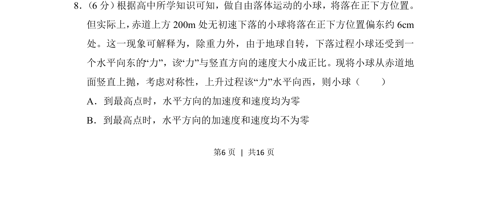
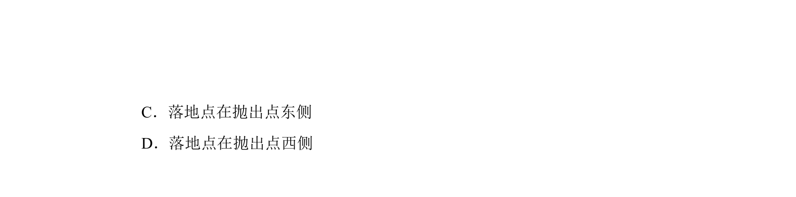
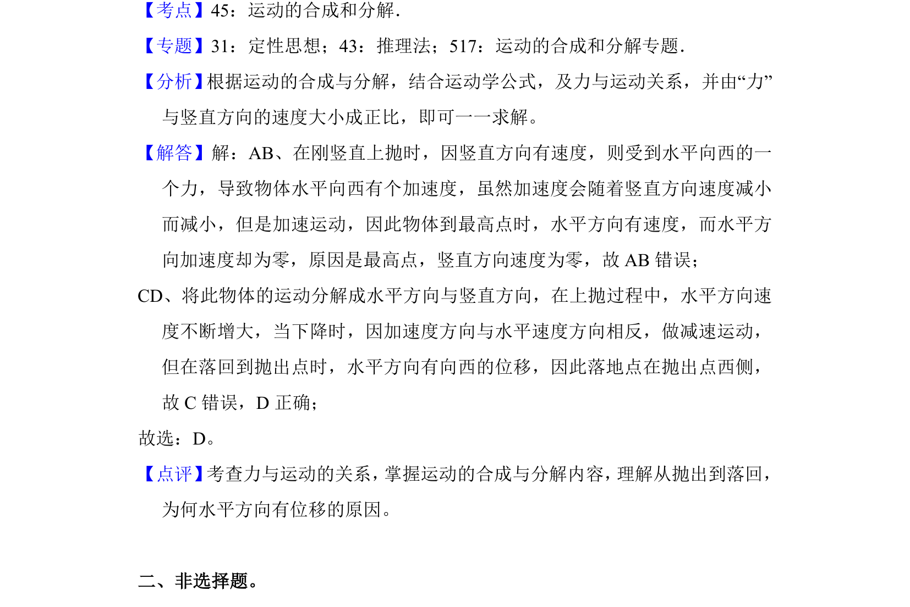

## 题面

## 摘要

考查地球自转影响下，竖直上抛小球水平方向的加速度与速度变化。

## 关联考点

- [[288-运动的合成与分解|运动的合成与分解]]
- [[229-牛顿第二定律|牛顿第二定律]]
- [[280-相对运动|相对运动]]

## 答案与解析

> 📄 原 PDF 第 6 页：`素材/真题/北京/2008-2024·（北京）物理高考真题/2018年高考物理试卷（北京）（解析卷）.pdf`

<!-- 题干文本-start -->
## 题干文本
8． （6分） 根据高中所学知识可知，做自由落体运动的小球，将落在正下方位置。
但实际上， 赤道上方200m处无初速下落的小球将落在正下方位置偏东约6cm
处。这一现象可解释为，除重力外，由于地球自转，下落过程小球还受到一
个水平向东的“力”，该“力”与竖直方向的速度大小成正比。现将小球从赤道地
面竖直上抛，考虑对称性，上升过程该“力”水平向西，则小球（　　）
A．到最高点时，水平方向的加速度和速度均为零
B．到最高点时，水平方向的加速度和速度均不为零
<!-- 题干文本-end -->

<!-- 解析文本-start -->
## 解析文本

<!-- 解析文本-end -->
