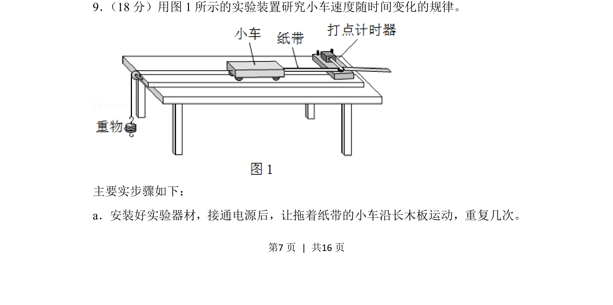
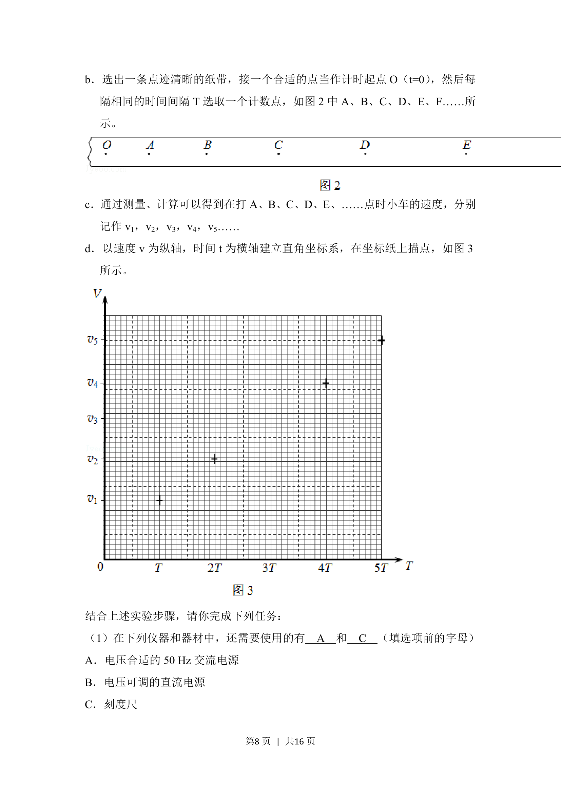
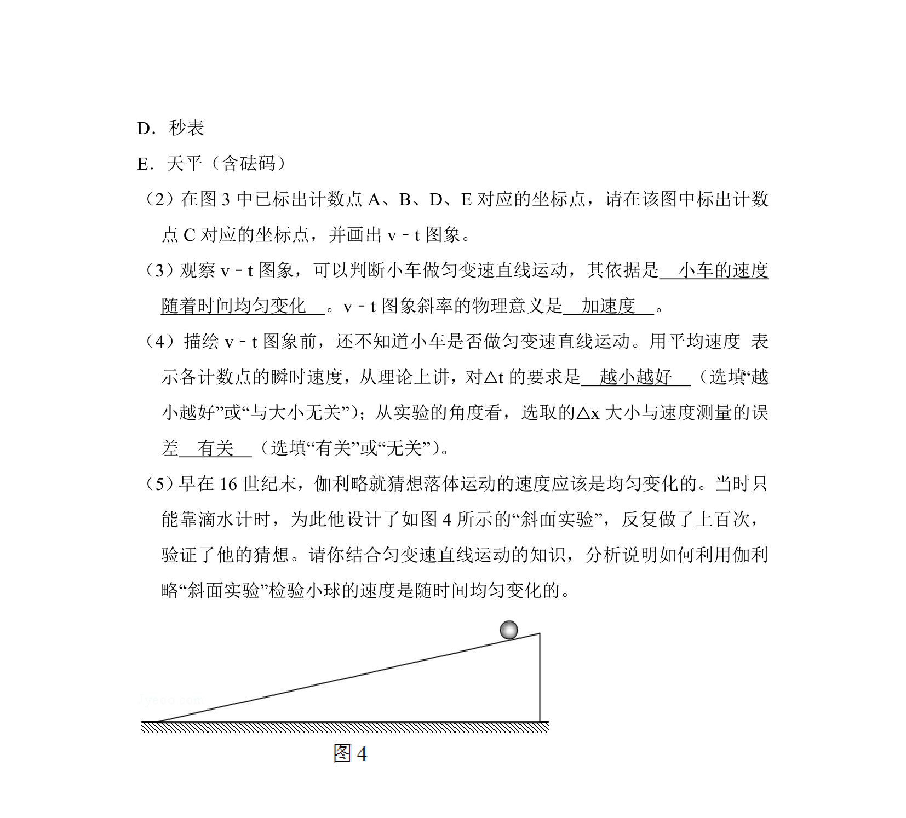
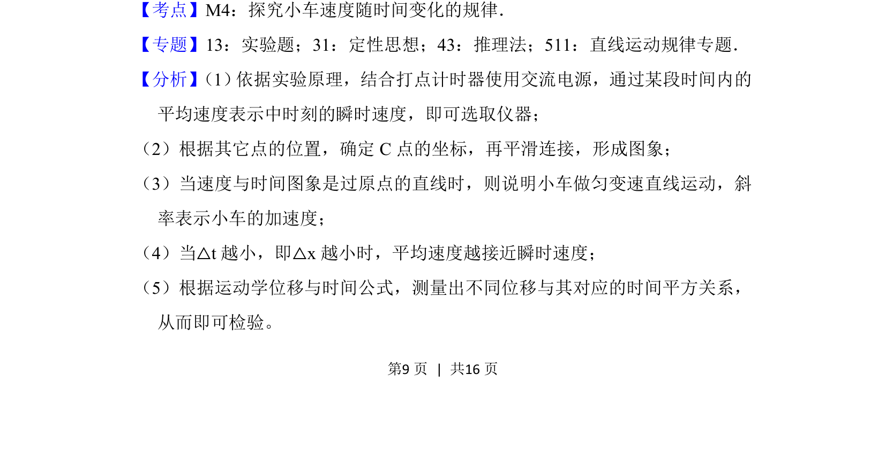
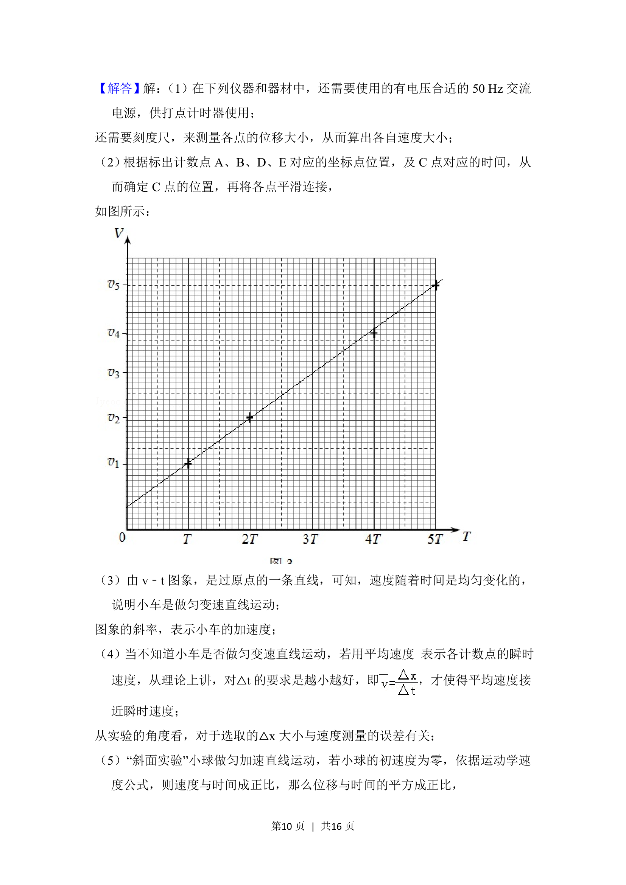
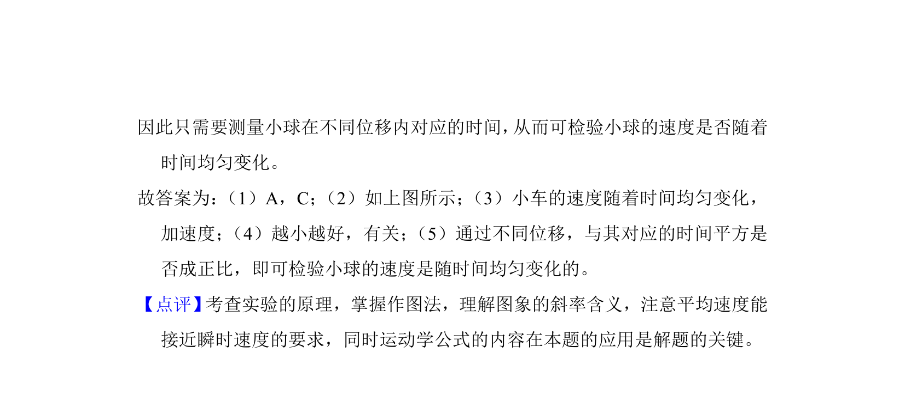

## 题面

## 摘要

研究小车速度随时间变化规律的实验操作步骤

## 关联考点

- [[探究小车速度随时间变化的规律]]
- [[755-打点计时器|打点计时器]]
- [[实验步骤]]

## 答案与解析

> 📄 原 PDF 第 7 页：`素材/真题/北京/2008-2024·（北京）物理高考真题/2018年高考物理试卷（北京）（解析卷）.pdf`

<!-- 题干文本-start -->
## 题干文本
9． （18分）用图1所示的实验装置研究小车速度随时间变化的规律。
主要实步骤如下：
a．安装好实验器材，接通电源后，让拖着纸带的小车沿长木板运动，重复几次。
<!-- 题干文本-end -->

<!-- 解析文本-start -->
## 解析文本

<!-- 解析文本-end -->
