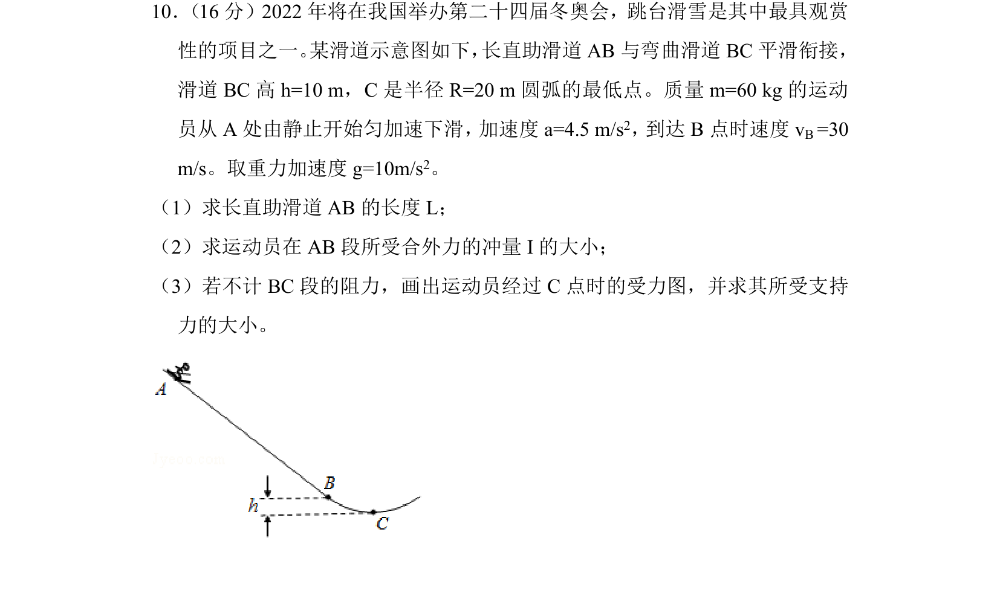
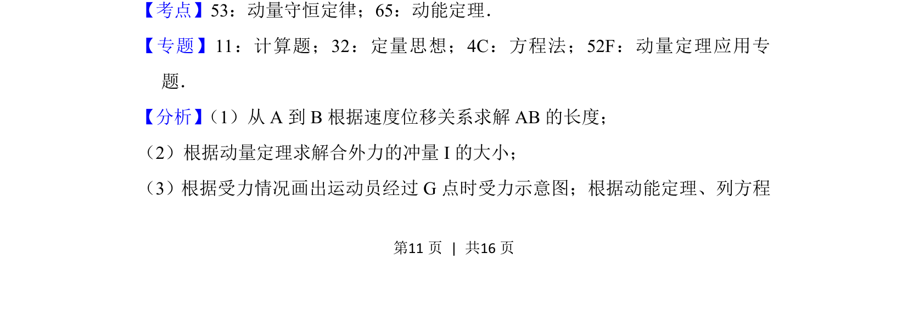
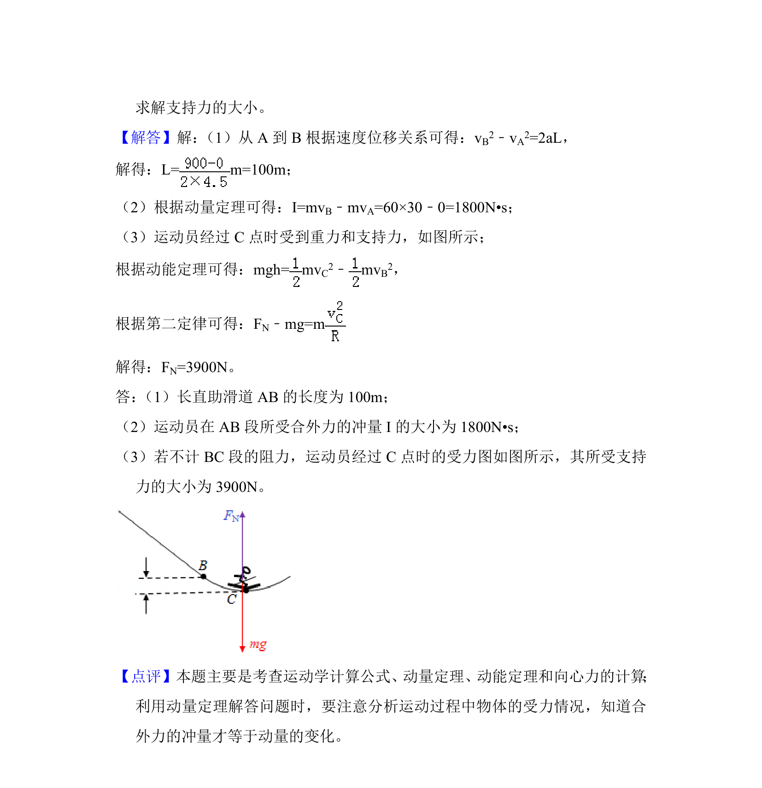

## 题面

## 摘要

本题以跳台滑雪为背景，考查匀变速直线运动、动量定理及圆周运动向心力与受力分析。

## 关联考点

- [[215-匀变速直线运动|匀变速直线运动]]
- [[349-动量定理|动量定理]]
- [[251-动能定理|动能定理]]
- [[572-圆周运动向心力|圆周运动向心力]]

## 答案与解析

> 📄 原 PDF 第 11 页：`素材/真题/北京/2008-2024·（北京）物理高考真题/2018年高考物理试卷（北京）（解析卷）.pdf`
