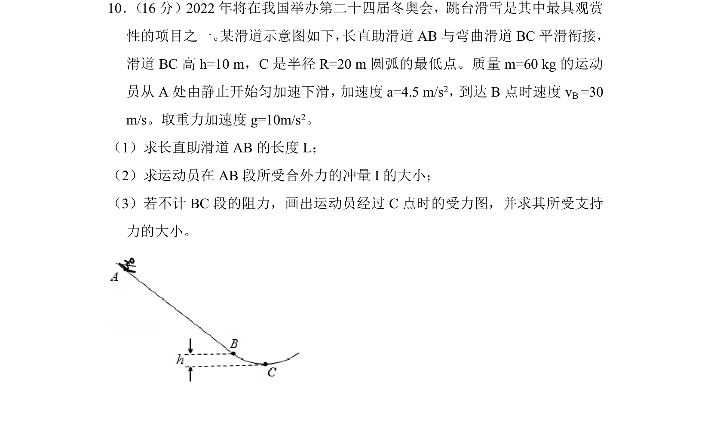
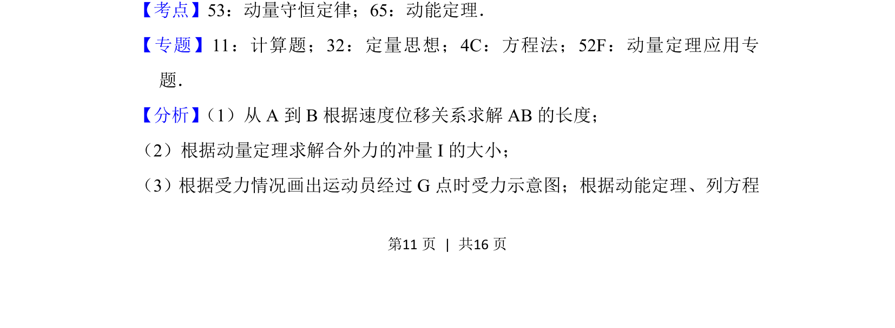
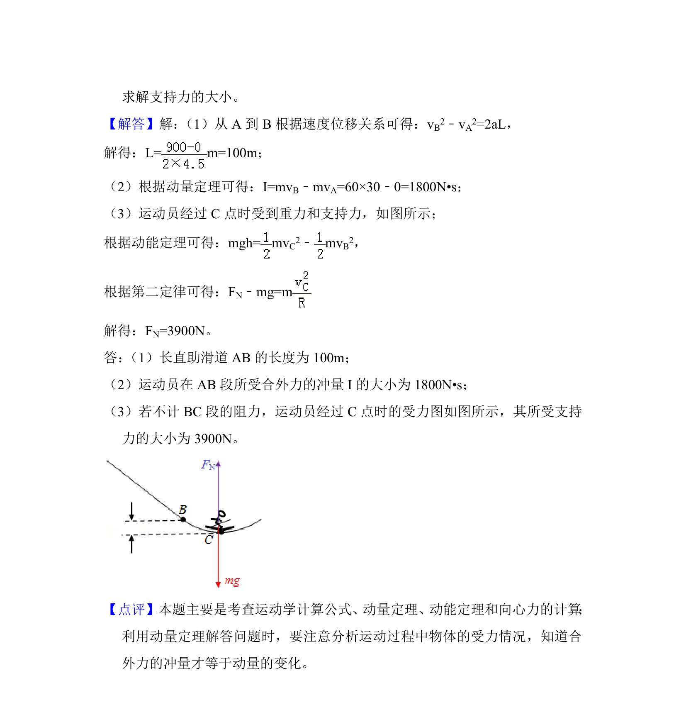

## 题面

## 摘要

本题以跳台滑雪为背景，考查匀变速直线运动、动量定理及圆周运动向心力与受力分析。

## 关联考点

- [[215-匀变速直线运动|匀变速直线运动]]
- [[349-动量定理|动量定理]]
- [[251-动能定理|动能定理]]
- [[572-圆周运动向心力|圆周运动向心力]]

## 答案与解析

> 📄 原 PDF 第 11 页：`素材/真题/北京/2008-2024·（北京）物理高考真题/2018年高考物理试卷（北京）（解析卷）.pdf`

<!-- 题干文本-start -->
## 题干文本
10． （16分）2022年将在我国举办第二十四届冬奥会，跳台滑雪是其中最具观赏
性的项目之一。 某滑道示意图如下， 长直助滑道AB与弯曲滑道BC平滑衔接，
滑道BC高h=10 m，C是半径R=20 m圆弧的最低点。质量m=60 kg的运动
员从A处由静止开始匀加速下滑， 加速度a=4.5 m/s2， 到达B点时速度vB =30 
m/s。取重力加速度g=10m/s 2。
（1）求长直助滑道AB的长度L；
（2）求运动员在AB段所受合外力的冲量I的大小；
（3）若不计BC段的阻力，画出运动员经过C点时的受力图，并求其所受支持
力的大小。
<!-- 题干文本-end -->

<!-- 解析文本-start -->
## 解析文本
【考点】53：动量守恒定律；65：动能定理．菁优网版权所有
【专题】11：计算题；32：定量思想；4C：方程法；52F：动量定理应用专
题．
【分析】 （1）从A到B根据速度位移关系求解AB的长度；
（2）根据动量定理求解合外力的冲量I的大小；
（3）根据受力情况画出运动员经过G点时受力示意图；根据动能定理、列方程
<!-- 解析文本-end -->
