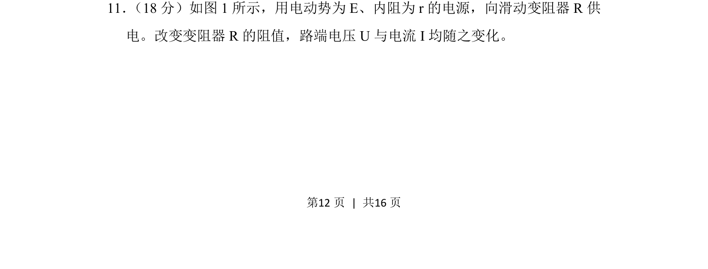
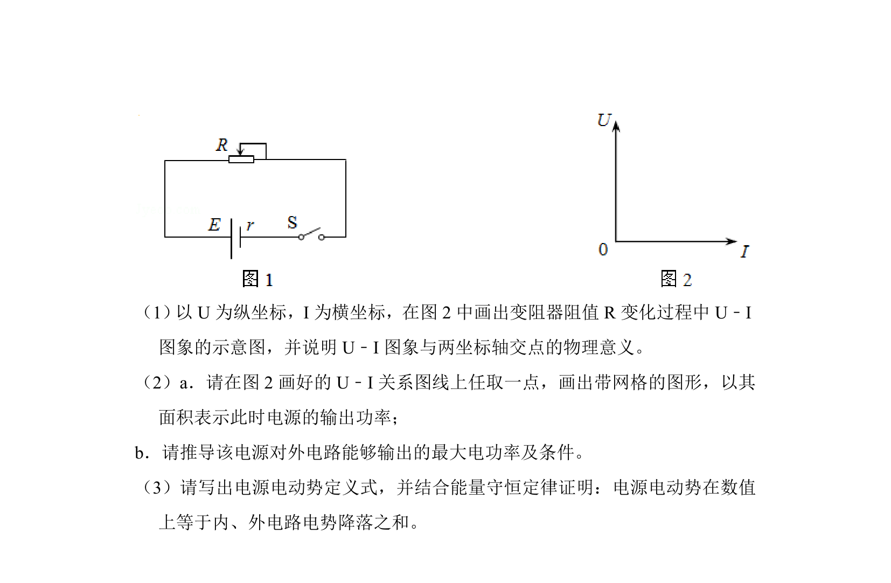
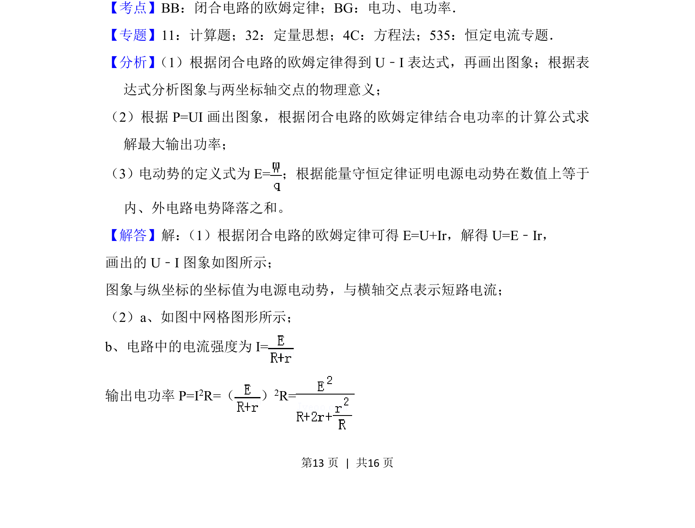
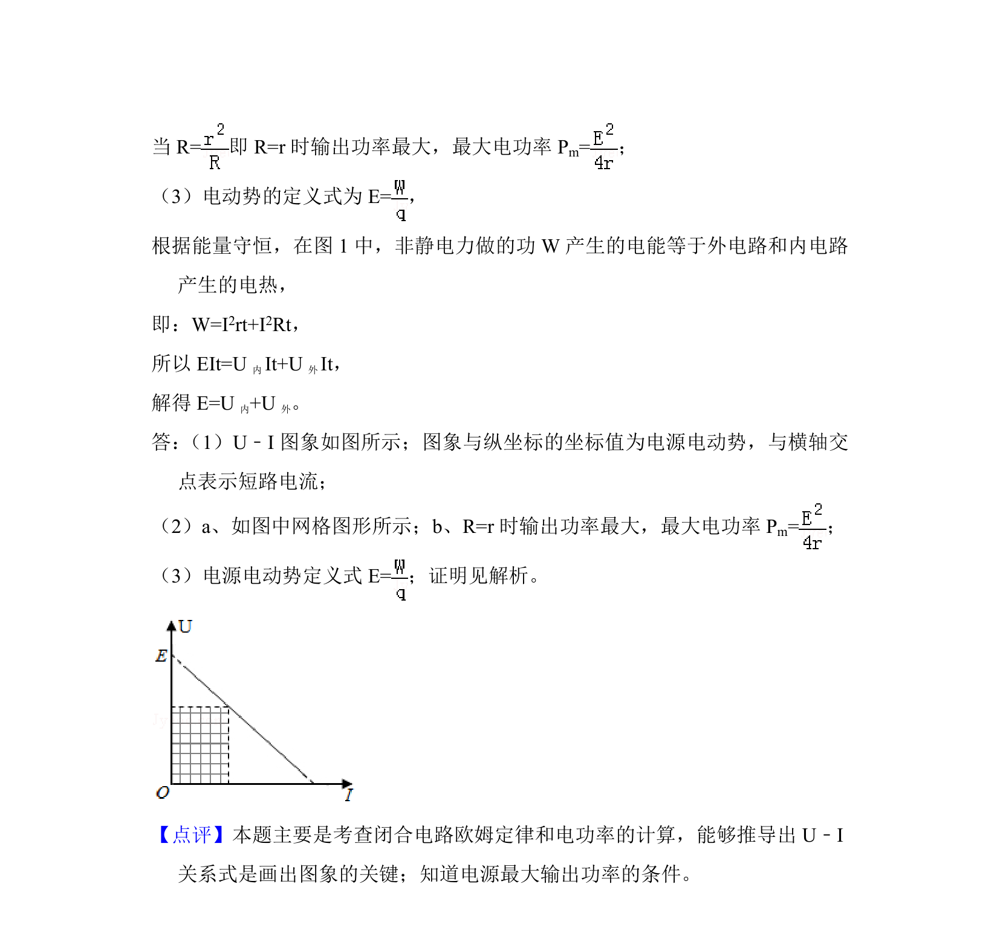

## 题面

## 摘要

通过调节滑动变阻器阻值，研究电源路端电压与电流的变化关系。

## 关联考点

- [[332-闭合电路欧姆定律|闭合电路欧姆定律]]
- [[329-路端电压|路端电压]]
- [[148-滑动变阻器|滑动变阻器]]
- [[电源电动势和内阻]]

## 答案与解析

> 📄 原 PDF 第 12 页：`素材/真题/北京/2008-2024·（北京）物理高考真题/2018年高考物理试卷（北京）（解析卷）.pdf`
