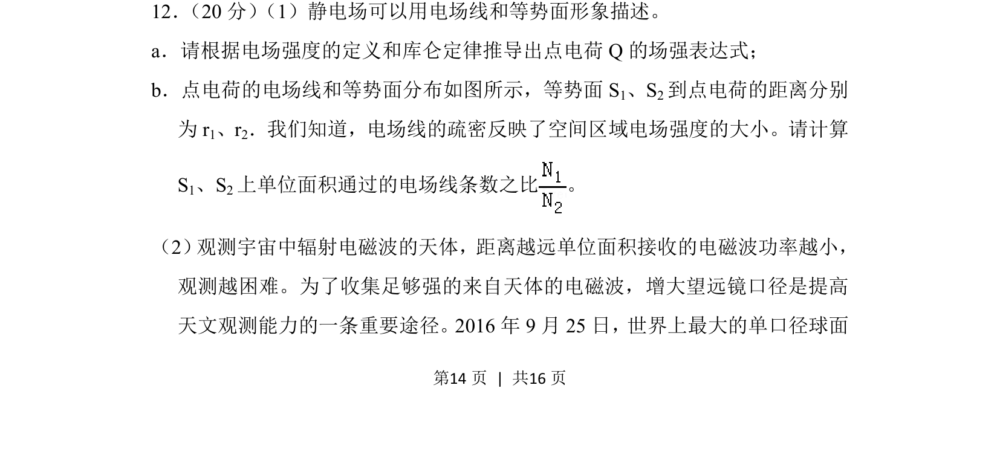
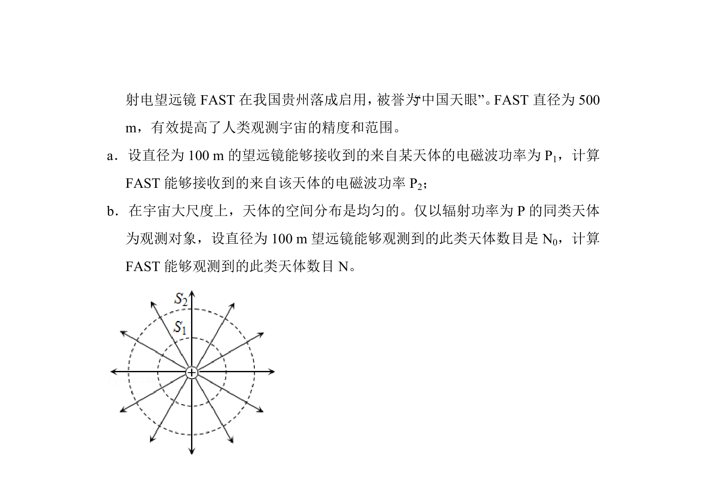
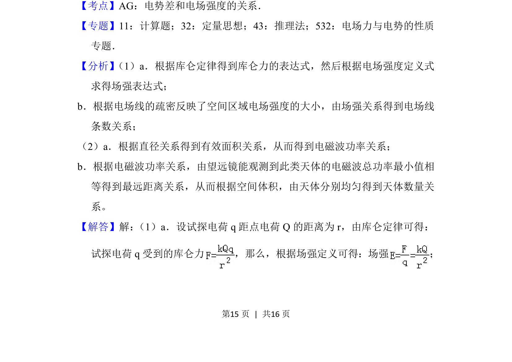
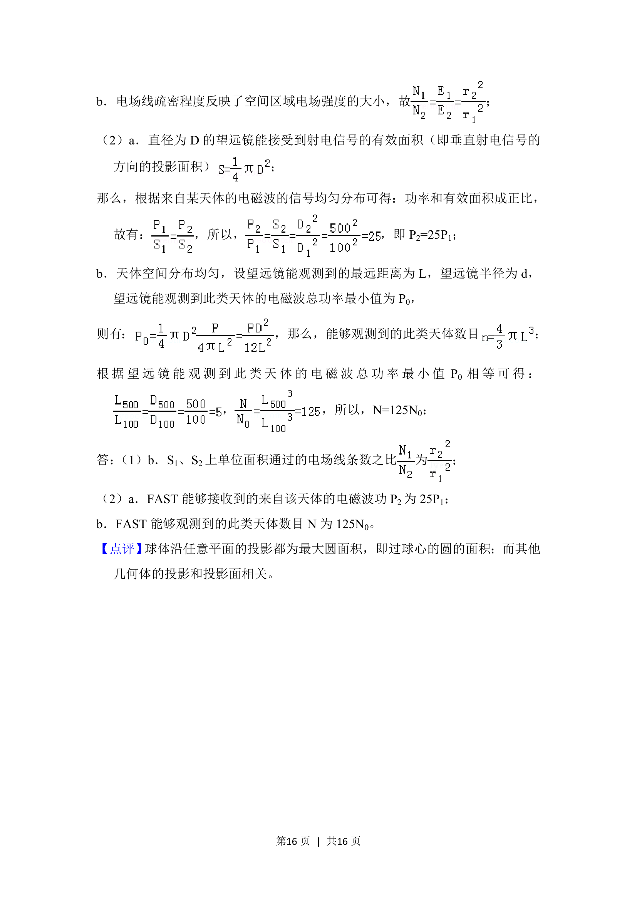

## 题面

## 摘要

该题考查点电荷场强表达式的推导，以及基于电场线密度和等势面的相关计算。

## 关联考点

- [[277-电场强度|电场强度]]
- [[263-库仑定律|库仑定律]]
- [[点电荷]]
- [[278-电场线|电场线]]
- [[282-等势面|等势面]]

## 答案与解析

> 📄 原 PDF 第 14 页：`素材/真题/北京/2008-2024·（北京）物理高考真题/2018年高考物理试卷（北京）（解析卷）.pdf`
