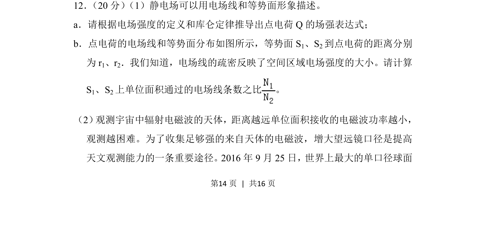
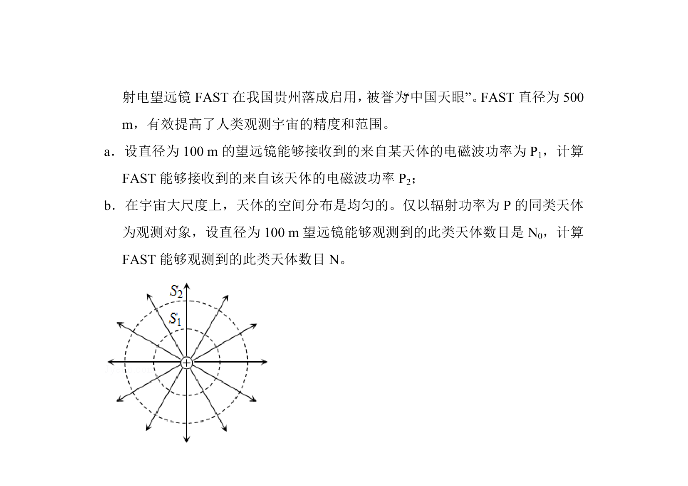
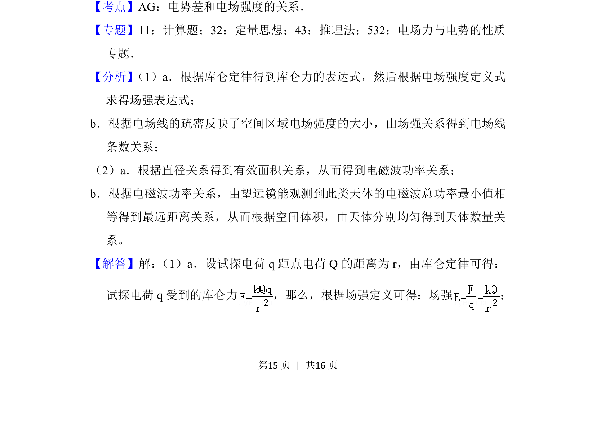
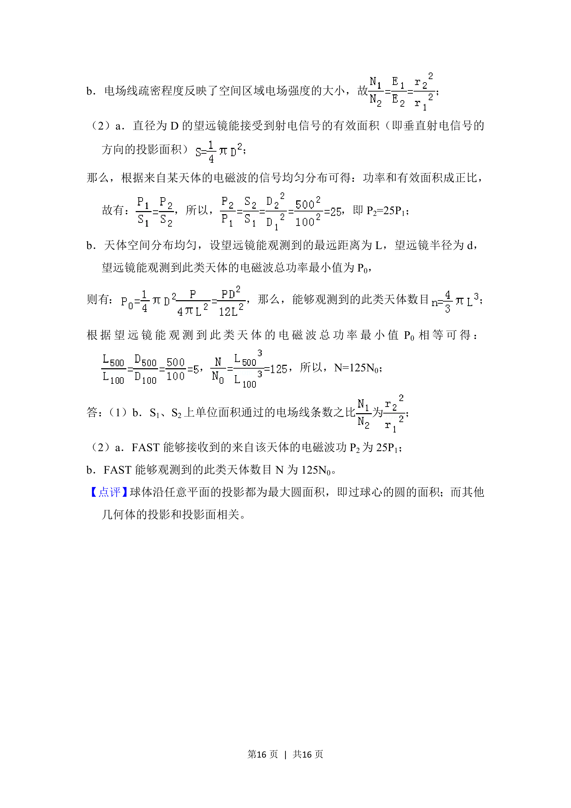

## 题面

## 摘要

该题考查点电荷场强表达式的推导，以及基于电场线密度和等势面的相关计算。

## 关联考点

- [[277-电场强度|电场强度]]
- [[263-库仑定律|库仑定律]]
- [[点电荷]]
- [[278-电场线|电场线]]
- [[282-等势面|等势面]]

## 答案与解析

> 📄 原 PDF 第 14 页：`素材/真题/北京/2008-2024·（北京）物理高考真题/2018年高考物理试卷（北京）（解析卷）.pdf`

<!-- 题干文本-start -->
## 题干文本
12． （20分） （1）静电场可以用电场线和等势面形象描述。
a．请根据电场强度的定义和库仑定律推导出点电荷Q的场强表达式；
b．点电荷的电场线和等势面分布如图所示，等势面S 1、S2到点电荷的距离分别
为r 1、r2．我们知道，电场线的疏密反映了空间区域电场强度的大小。请计算
S1、S2上单位面积通过的电场线条数之比 。
（2） 观测宇宙中辐射电磁波的天体，距离越远单位面积接收的电磁波功率越小，
观测越困难。为了收集足够强的来自天体的电磁波，增大望远镜口径是提高
天文观测能力的一条重要途径。2016年9月25日，世界上最大的单口径球面
<!-- 题干文本-end -->

<!-- 解析文本-start -->
## 解析文本

<!-- 解析文本-end -->
