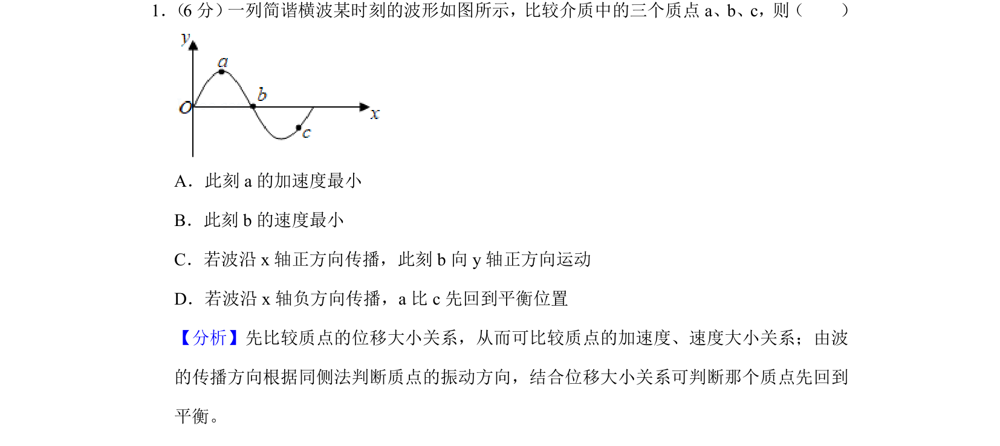
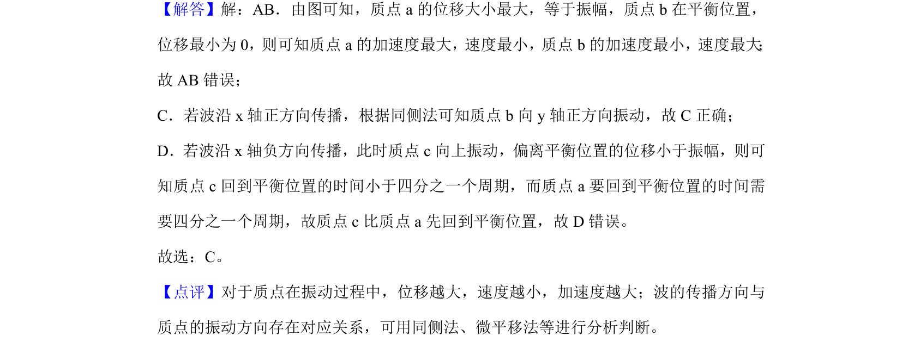

## 题面

## 摘要

考查简谐横波波形图中质点加速度、速度大小比较及振动方向判断

## 关联考点

- [[简谐运动回复力与加速度]]
- [[630-横波的图象|波动图像]]
- [[同侧法判断振动方向]]

## 答案与解析

> 📄 原 PDF 第 1 页：`素材/真题/北京/2008-2024·（北京）物理高考真题/2019年高考物理试卷（北京）（解析卷）.pdf`

<!-- 题干文本-start -->
## 题干文本
1． （6分） 一列简谐横波某时刻的波形如图所示，比较介质中的三个质点a、b、c，则（　　）
A．此刻a的加速度最小
B．此刻b的速度最小
C．若波沿x轴正方向传播，此刻b向y轴正方向运动
D．若波沿x轴负方向传播，a比c先回到平衡位置
<!-- 题干文本-end -->

<!-- 解析文本-start -->
## 解析文本
【分析】先比较质点的位移大小关系，从而可比较质点的加速度、速度大小关系；由波
的传播方向根据同侧法判断质点的振动方向，结合位移大小关系可判断那个质点先回到
平衡。
【解答】解：AB．由图可知，质点a的位移大小最大，等于振幅，质点b在平衡位置，
位移最小为0，则可知质点a的加速度最大，速度最小，质点b的加速度最小，速度最大 ；
故AB错误；
C．若波沿x轴正方向传播，根据同侧法可知质点b向y轴正方向振动，故C正确；
D．若波沿x轴负方向传播，此时质点c向上振动，偏离平衡位置的位移小于振幅，则可
知质点c回到平衡位置的时间小于四分之一个周期，而质点a要回到平衡位置的时间需
要四分之一个周期，故质点c比质点a先回到平衡位置，故D错误。
故选：C。
【点评】对于质点在振动过程中，位移越大，速度越小，加速度越大；波的传播方向与
质点的振动方向存在对应关系，可用同侧法、微平移法等进行分析判断。
<!-- 解析文本-end -->
