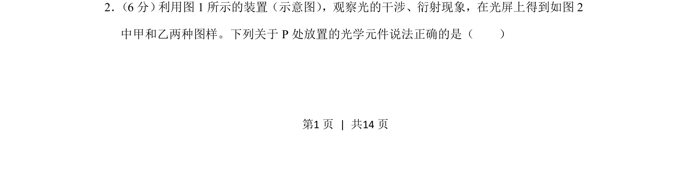
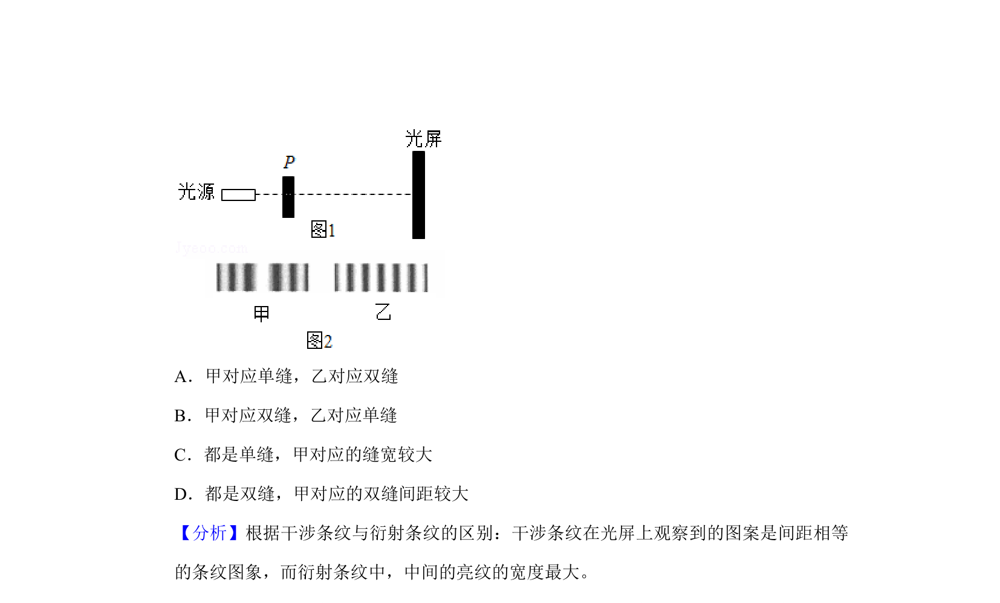
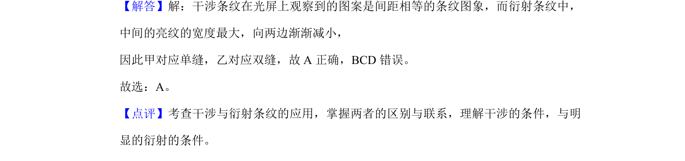

## 题面

## 摘要

本题考查通过干涉和衍射图样判断光学元件类型

## 关联考点

- [[340-光的干涉|光的干涉]]
- [[342-光的衍射-高中|光的衍射]]
- [[552-双缝干涉|双缝干涉]]
- [[单缝衍射]]

## 答案与解析

> 📄 原 PDF 第 1 页：`素材/真题/北京/2008-2024·（北京）物理高考真题/2019年高考物理试卷（北京）（解析卷）.pdf`
