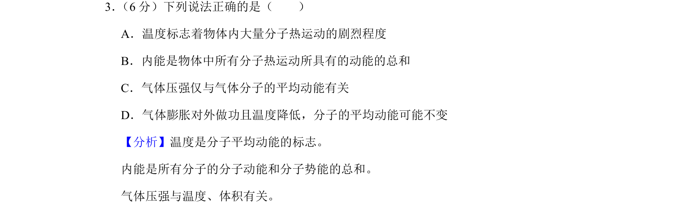
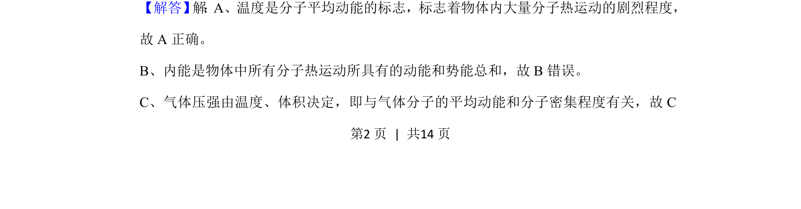
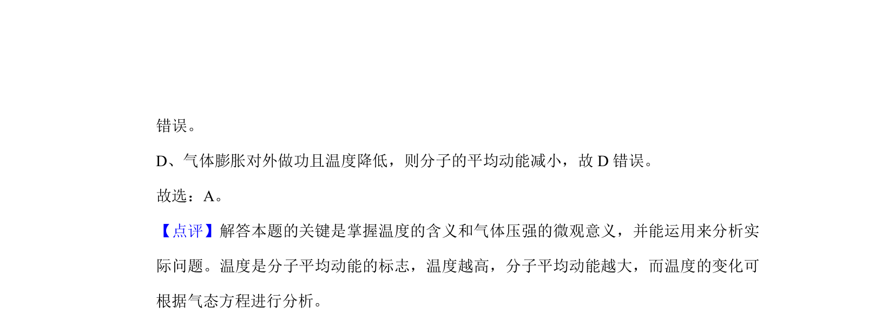

## 题面

## 摘要

考查温度、内能和气体压强的概念辨析，涉及分子动理论的基本理解。

## 关联考点

- [[035-温度|温度]]
- [[127-内能|内能]]
- [[气体压强]]
- [[839-分子平均动能|分子平均动能]]

## 答案与解析

> 📄 原 PDF 第 2 页：`素材/真题/北京/2008-2024·（北京）物理高考真题/2019年高考物理试卷（北京）（解析卷）.pdf`
