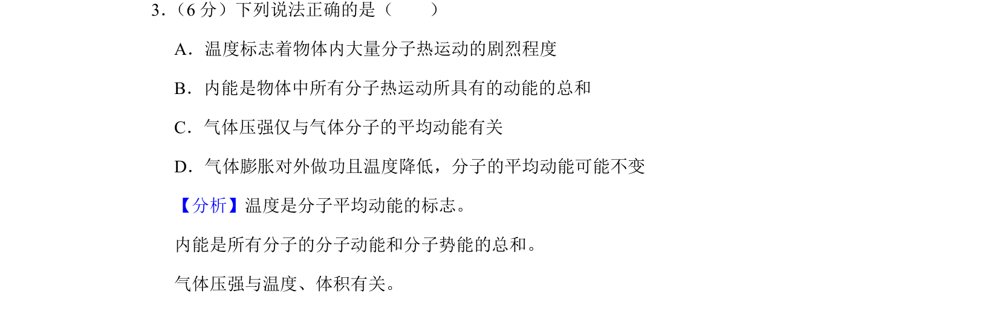
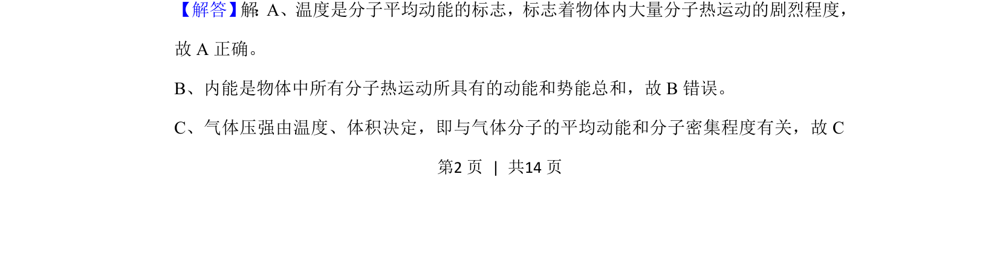
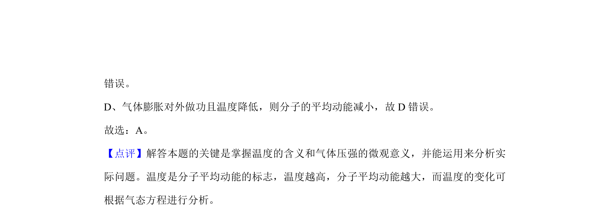

## 题面

## 摘要

考查温度、内能和气体压强的概念辨析，涉及分子动理论的基本理解。

## 关联考点

- [[035-温度|温度]]
- [[127-内能|内能]]
- [[气体压强]]
- [[839-分子平均动能|分子平均动能]]

## 答案与解析

> 📄 原 PDF 第 2 页：`素材/真题/北京/2008-2024·（北京）物理高考真题/2019年高考物理试卷（北京）（解析卷）.pdf`

<!-- 题干文本-start -->
## 题干文本
3． （6分）下列说法正确的是（　　）
A．温度标志着物体内大量分子热运动的剧烈程度
B．内能是物体中所有分子热运动所具有的动能的总和
C．气体压强仅与气体分子的平均动能有关
D．气体膨胀对外做功且温度降低，分子的平均动能可能不变
<!-- 题干文本-end -->

<!-- 解析文本-start -->
## 解析文本
【分析】温度是分子平均动能的标志。
内能是所有分子的分子动能和分子势能的总和。
气体压强与温度、体积有关。
【解答】 解 ：A、温度是分子平均动能的标志，标志着物体内大量分子热运动的剧烈程度，
故A正确。
B、内能是物体中所有分子热运动所具有的动能和势能总和，故B错误。
C、气体压强由温度、体积决定，即与气体分子的平均动能和分子密集程度有关，故C
<!-- 解析文本-end -->
