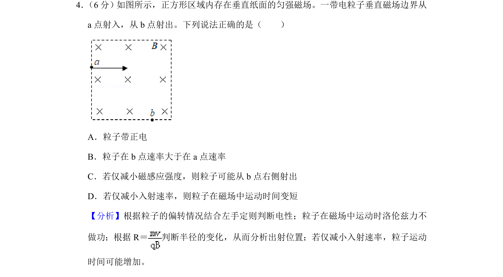
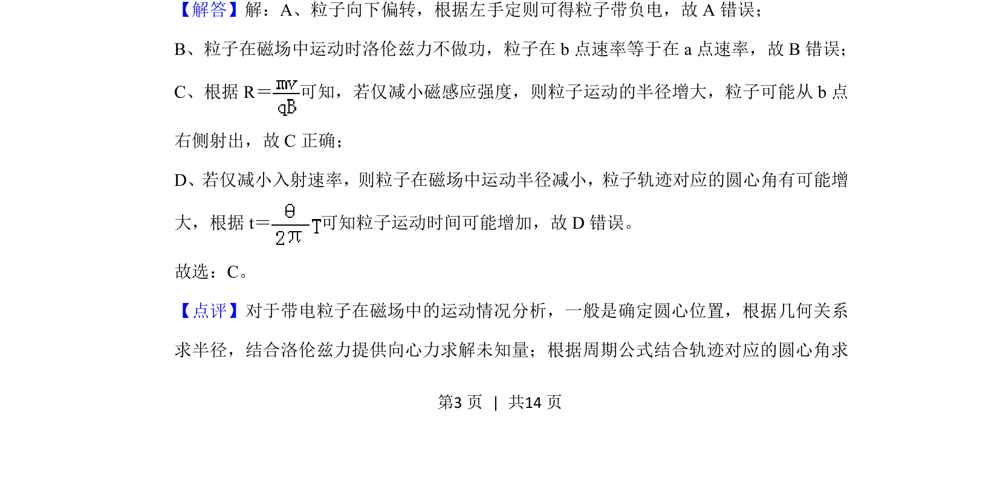

## 题面

## 摘要

带电粒子在匀强磁场中偏转，考查左手定则、半径公式及运动时间分析

## 关联考点

- [[595-带电粒子在匀强磁场中的运动|带电粒子在匀强磁场中的运动]]
- [[297-安培力方向-左手定则|左手定则]]
- [[649-洛伦兹力提供向心力|洛伦兹力提供向心力]]
- [[762-半径公式|半径公式]]

## 答案与解析

> 📄 原 PDF 第 3 页：`素材/真题/北京/2008-2024·（北京）物理高考真题/2019年高考物理试卷（北京）（解析卷）.pdf`
