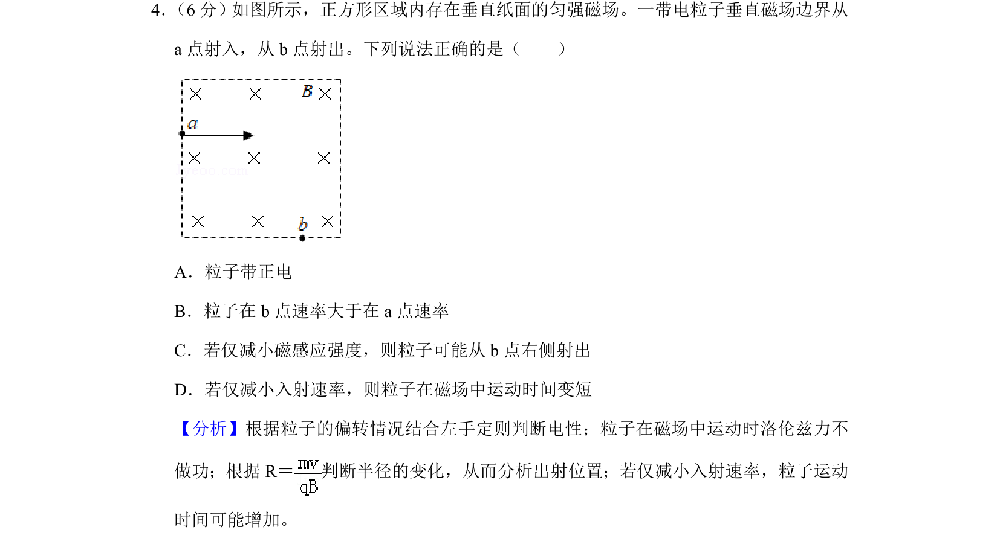
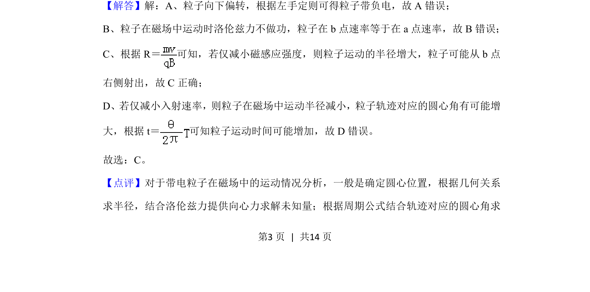

## 题面

## 摘要

带电粒子在匀强磁场中偏转，考查左手定则、半径公式及运动时间分析

## 关联考点

- [[595-带电粒子在匀强磁场中的运动|带电粒子在匀强磁场中的运动]]
- [[297-安培力方向-左手定则|左手定则]]
- [[649-洛伦兹力提供向心力|洛伦兹力提供向心力]]
- [[761-半径公式|半径公式]]

## 答案与解析

> 📄 原 PDF 第 3 页：`素材/真题/北京/2008-2024·（北京）物理高考真题/2019年高考物理试卷（北京）（解析卷）.pdf`

<!-- 题干文本-start -->
## 题干文本
4． （6分）如图所示，正方形区域内存在垂直纸面的匀强磁场。一带电粒子垂直磁场边界从
a点射入，从b点射出。下列说法正确的是（　　）
A．粒子带正电
B．粒子在b点速率大于在a点速率
C．若仅减小磁感应强度，则粒子可能从b点右侧射出
D．若仅减小入射速率，则粒子在磁场中运动时间变短
<!-- 题干文本-end -->

<!-- 解析文本-start -->
## 解析文本
【分析】根据粒子的偏转情况结合左手定则判断电性；粒子在磁场中运动时洛伦兹力不
做功；根据R＝ 判断半径的变化，从而分析出射位置；若仅减小入射速率，粒子运动
时间可能增加。
【解答】解：A、粒子向下偏转，根据左手定则可得粒子带负电，故A错误；
B、粒子在磁场中运动时洛伦兹力不做功，粒子在b点速率等于在a点速率，故B错误；
C、根据R＝ 可知，若仅减小磁感应强度，则粒子运动的半径增大，粒子可能从b点
右侧射出，故C正确；
D、若仅减小入射速率，则粒子在磁场中运动半径减小，粒子轨迹对应的圆心角有可能增
大，根据t＝ 可知粒子运动时间可能增加，故D错误。
故选：C。
【点评】对于带电粒子在磁场中的运动情况分析，一般是确定圆心位置，根据几何关系
求半径，结合洛伦兹力提供向心力求解未知量；根据周期公式结合轨迹对应的圆心角求
<!-- 解析文本-end -->
