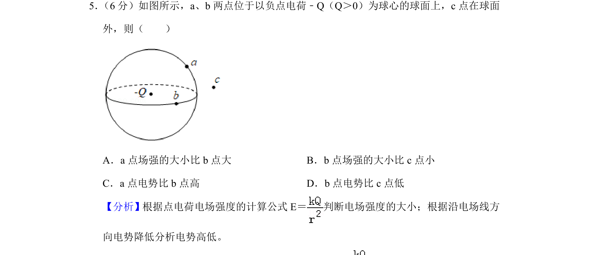
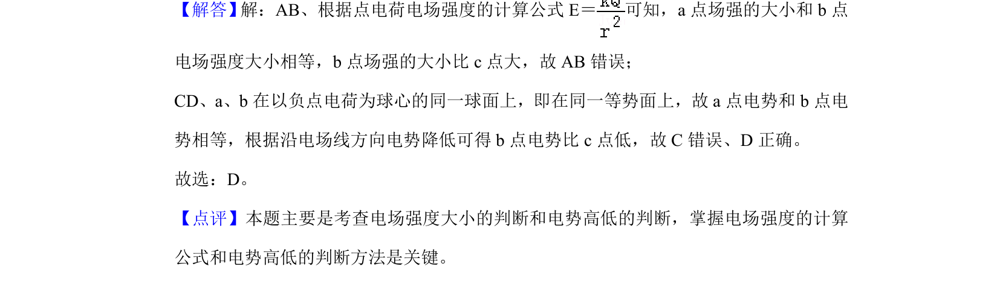

## 题面

## 摘要

a点与b点电场强度及电势比较，涉及点电荷场强公式与等势面、电势降低规律

## 关联考点

- [[864-点电荷电场强度|点电荷电场强度]]
- [[282-等势面|等势面]]
- [[电势高低判断]]

## 答案与解析

> 📄 原 PDF 第 4 页：`素材/真题/北京/2008-2024·（北京）物理高考真题/2019年高考物理试卷（北京）（解析卷）.pdf`

<!-- 题干文本-start -->
## 题干文本
5． （6分）如图所示，a、b两点位于以负点电荷﹣Q（Q＞0）为球心的球面上，c点在球面
外，则（　　）
A．a点场强的大小比b点大B．b点场强的大小比c点小
C．a点电势比b点高D．b点电势比c点低
<!-- 题干文本-end -->

<!-- 解析文本-start -->
## 解析文本
【分析】根据点电荷电场强度的计算公式E＝ 判断电场强度的大小；根据沿电场线方
向电势降低分析电势高低。
【解答】 解：AB、根据点电荷电场强度的计算公式E＝ 可知，a点场强的大小和b点
电场强度大小相等，b点场强的大小比c点大，故AB错误；
CD、a、b在以负点电荷为球心的同一球面上，即在同一等势面上，故a点电势和b点电
势相等，根据沿电场线方向电势降低可得b点电势比c点低，故C错误、D正确。
故选：D。
【点评】本题主要是考查电场强度大小的判断和电势高低的判断，掌握电场强度的计算
公式和电势高低的判断方法是关键。
<!-- 解析文本-end -->
