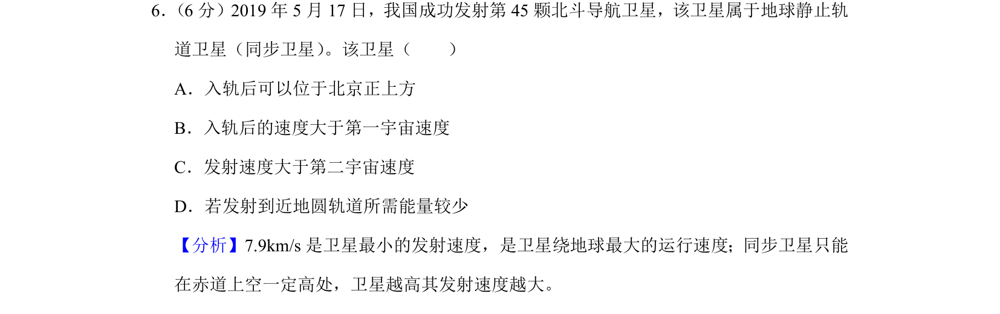
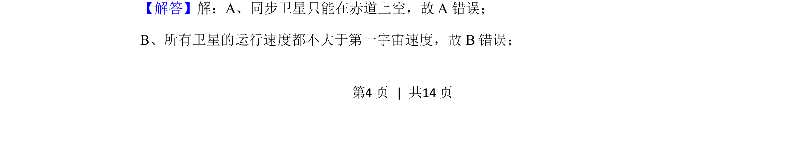
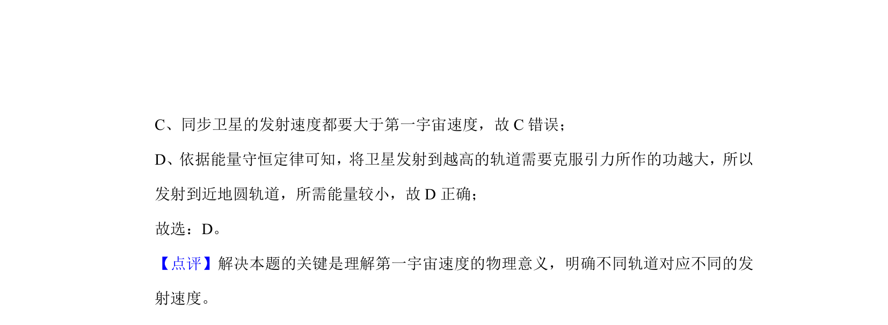

## 题面

## 摘要

同步卫星轨道、宇宙速度与发射能量判断。

## 关联考点

- [[560-同步卫星|同步卫星]]
- [[281-第一宇宙速度|第一宇宙速度]]
- [[第二宇宙速度]]
- [[卫星发射能量]]

## 答案与解析

> 📄 原 PDF 第 4 页：`素材/真题/北京/2008-2024·（北京）物理高考真题/2019年高考物理试卷（北京）（解析卷）.pdf`
