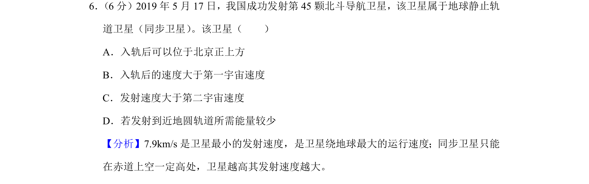
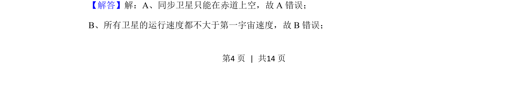
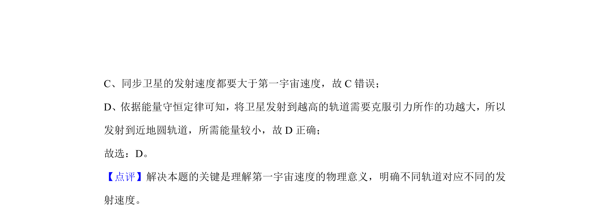

## 题面

## 摘要

同步卫星轨道、宇宙速度与发射能量判断。

## 关联考点

- [[560-同步卫星|同步卫星]]
- [[281-第一宇宙速度|第一宇宙速度]]
- [[851-第二宇宙速度|第二宇宙速度]]
- [[卫星发射能量]]

## 答案与解析

> 📄 原 PDF 第 4 页：`素材/真题/北京/2008-2024·（北京）物理高考真题/2019年高考物理试卷（北京）（解析卷）.pdf`

<!-- 题干文本-start -->
## 题干文本
6． （6分）2019年5月17日，我国成功发射第45颗北斗导航卫星，该卫星属于地球静止轨
道卫星（同步卫星） 。该卫星（　　）
A．入轨后可以位于北京正上方
B．入轨后的速度大于第一宇宙速度
C．发射速度大于第二宇宙速度
D．若发射到近地圆轨道所需能量较少
<!-- 题干文本-end -->

<!-- 解析文本-start -->
## 解析文本
【分析】7.9km/s是卫星最小的发射速度，是卫星绕地球最大的运行速度；同步卫星只能
在赤道上空一定高处，卫星越高其发射速度越大。
【解答】解：A、同步卫星只能在赤道上空，故A错误；
B、所有卫星的运行速度都不大于第一宇宙速度，故B错误；
<!-- 解析文本-end -->
