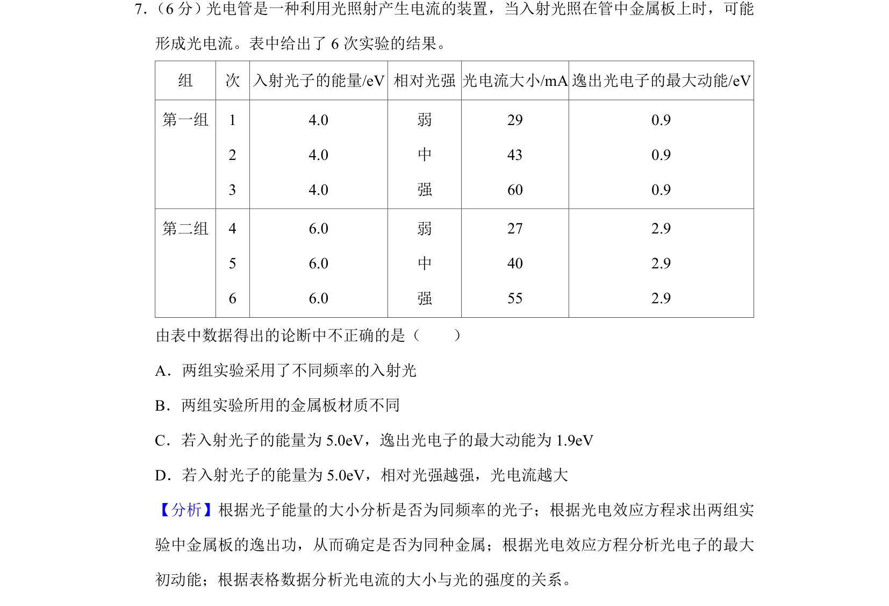
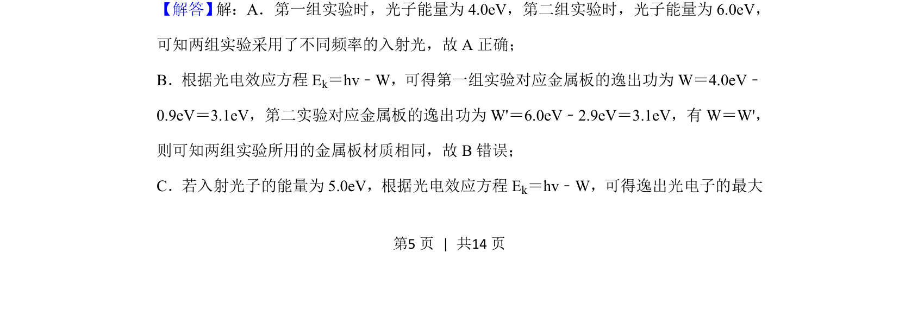
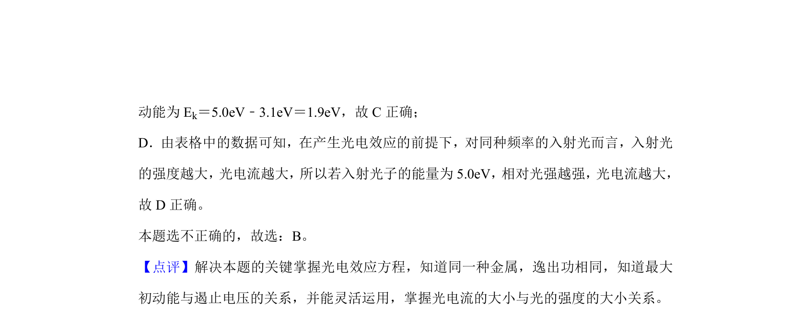

## 题面

## 摘要

通过光电效应实验数据判断光频率、金属逸出功及光电流影响因素

## 关联考点

- [[417-光电效应|光电效应]]
- [[光电效应方程]]
- [[746-逸出功|逸出功]]
- [[光电流]]

## 答案与解析

> 📄 原 PDF 第 5 页：`素材/真题/北京/2008-2024·（北京）物理高考真题/2019年高考物理试卷（北京）（解析卷）.pdf`
