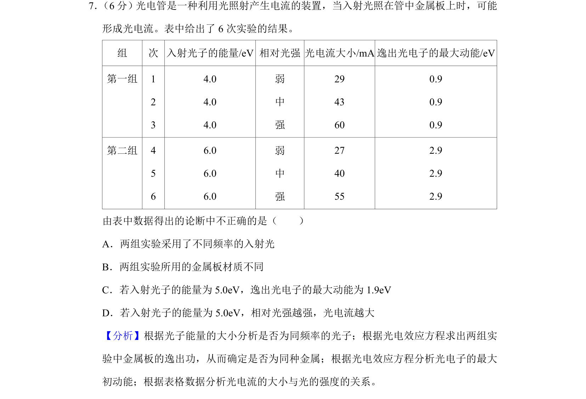
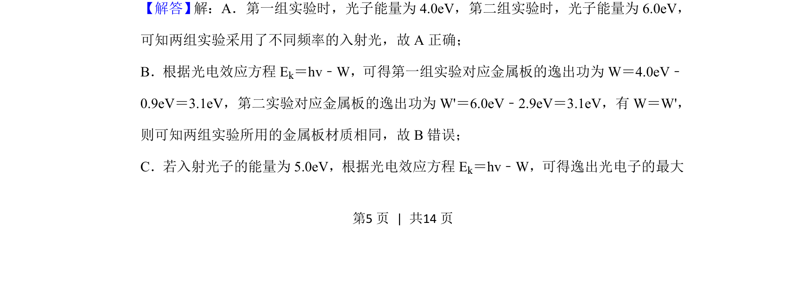
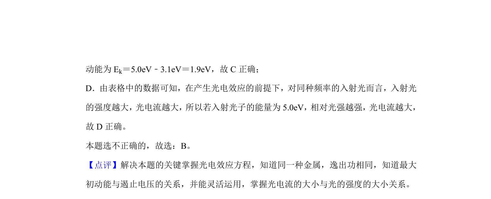

## 题面

## 摘要

通过光电效应实验数据判断光频率、金属逸出功及光电流影响因素

## 关联考点

- [[417-光电效应|光电效应]]
- [[838-光电效应方程|光电效应方程]]
- [[745-逸出功|逸出功]]
- [[光电流]]

## 答案与解析

> 📄 原 PDF 第 5 页：`素材/真题/北京/2008-2024·（北京）物理高考真题/2019年高考物理试卷（北京）（解析卷）.pdf`

<!-- 题干文本-start -->
## 题干文本
7． （6分）光电管是一种利用光照射产生电流的装置，当入射光照在管中金属板上时，可能
形成光电流。表中给出了6次实验的结果。 
组 次 入射光子的能量/eV 相对光强 光电流大小/mA逸出光电子的最大动能/eV
第一组 1
2
3
4.0
4.0
4.0
弱
中
强
29
43
60
0.9
0.9
0.9
第二组 4
5
6
6.0
6.0
6.0
弱
中
强
27
40
55
2.9
2.9
2.9
由表中数据得出的论断中不正确的是（　　）
A．两组实验采用了不同频率的入射光
B．两组实验所用的金属板材质不同
C．若入射光子的能量为5.0eV，逸出光电子的最大动能为1.9eV
D．若入射光子的能量为5.0eV，相对光强越强，光电流越大
<!-- 题干文本-end -->

<!-- 解析文本-start -->
## 解析文本
【分析】根据光子能量的大小分析是否为同频率的光子；根据光电效应方程求出两组实
验中金属板的逸出功，从而确定是否为同种金属；根据光电效应方程分析光电子的最大
初动能；根据表格数据分析光电流的大小与光的强度的关系。
【解答】 解：A．第一组实验时，光子能量为4.0eV，第二组实验时，光子能量为6.0eV，
可知两组实验采用了不同频率的入射光，故A正确；
B．根据光电效应方程E k＝hv﹣W，可得第一组实验对应金属板的逸出功为W＝4.0eV﹣
0.9eV＝3.1eV，第二实验对应金属板的逸出功为W'＝6.0eV﹣2.9eV＝3.1eV，有W＝W'，
则可知两组实验所用的金属板材质相同，故B错误；
C．若入射光子的能量为5.0eV，根据光电效应方程E k＝hv﹣W，可得逸出光电子的最大
<!-- 解析文本-end -->
