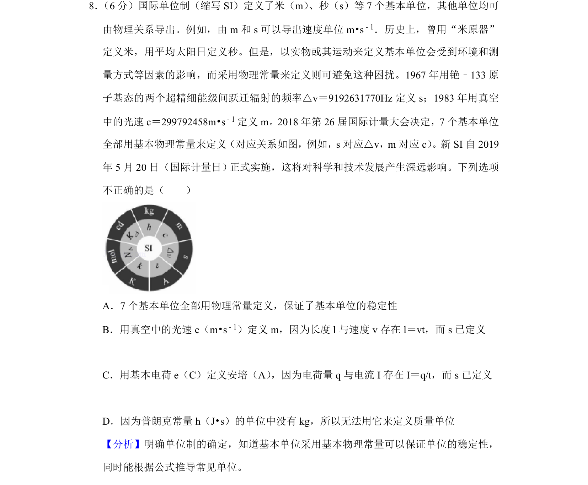
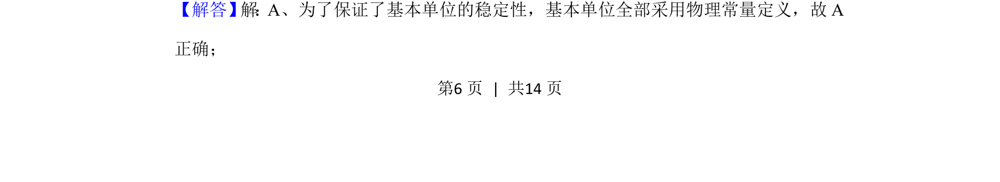
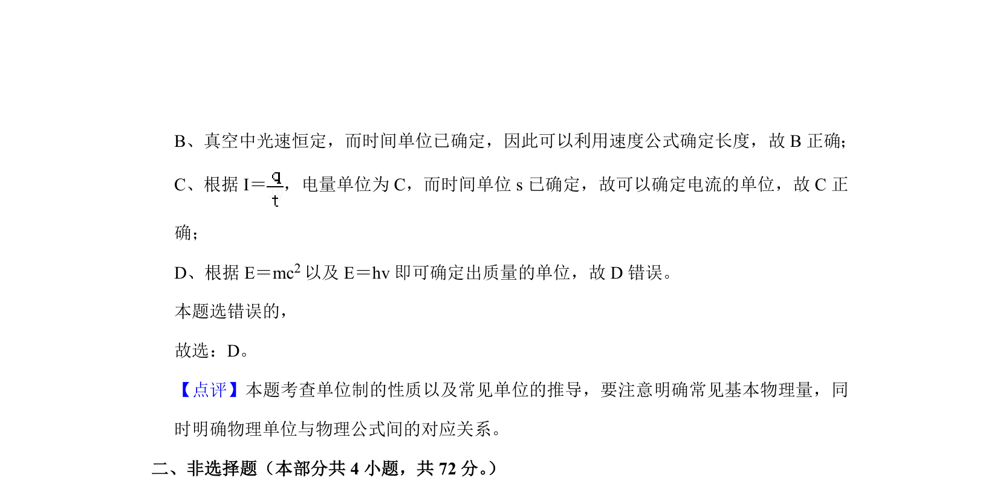

## 题面

## 摘要

国际单位制中基本单位用物理常量重新定义的理解，判断不正确选项。

## 关联考点

- [[306-物理量单位制-高中|国际单位制]]
- [[基本物理常量]]
- [[单位定义]]
- [[006-光速|光速]]

## 答案与解析

> 📄 原 PDF 第 6 页：`素材/真题/北京/2008-2024·（北京）物理高考真题/2019年高考物理试卷（北京）（解析卷）.pdf`
