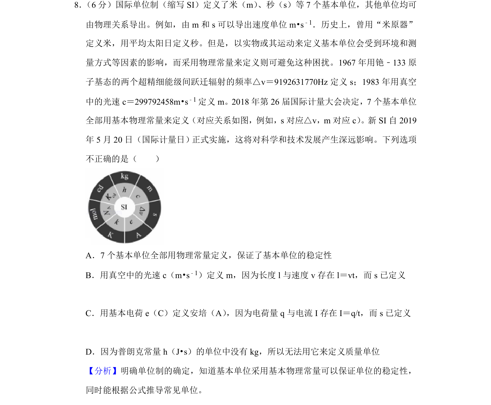
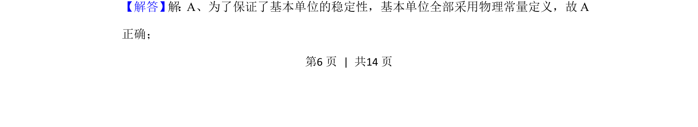
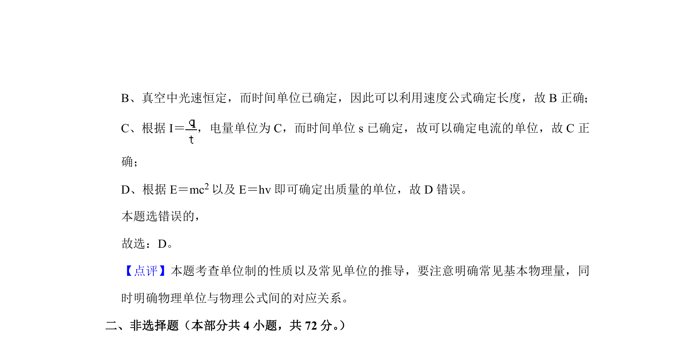

## 题面

## 摘要

国际单位制中基本单位用物理常量重新定义的理解，判断不正确选项。

## 关联考点

- [[306-物理量单位制-高中|国际单位制]]
- [[基本物理常量]]
- [[单位定义]]
- [[006-光速|光速]]

## 答案与解析

> 📄 原 PDF 第 6 页：`素材/真题/北京/2008-2024·（北京）物理高考真题/2019年高考物理试卷（北京）（解析卷）.pdf`

<!-- 题干文本-start -->
## 题干文本
8． （6分）国际单位制（缩写SI）定义了米（m） 、秒（s）等7个基本单位，其他单位均可
由物理关系导出。例如，由m和s可以导出速度单位m•s ﹣1．历史上，曾用“米原器”
定义米，用平均太阳日定义秒。但是，以实物或其运动来定义基本单位会受到环境和测
量方式等因素的影响，而采用物理常量来定义则可避免这种困扰。1967年用铯﹣133原
子基态的两个超精细能级间跃迁辐射的频率△v＝9192631770Hz定义s；1983年用真空
中的光速c＝299792458m•s ﹣1定义m。2018年第26届国际计量大会决定，7个基本单位
全部用基本物理常量来定义（对应关系如图，例如，s对应△v，m对应c） 。新SI自2019
年5月20日（国际计量日） 正式实施，这将对科学和技术发展产生深远影响。下列选项
不正确的是（　　）
A．7个基本单位全部用物理常量定义，保证了基本单位的稳定性
B．用真空中的光速c（m•s ﹣1）定义m，因为长度l与速度v存在l＝vt，而s已定义
C．用基本电荷e（C）定义安培（A） ，因为电荷量q与电流I存在I＝q/t，而s已定义
D．因为普朗克常量h（J•s）的单位中没有kg，所以无法用它来定义质量单位
<!-- 题干文本-end -->

<!-- 解析文本-start -->
## 解析文本
【分析】明确单位制的确定，知道基本单位采用基本物理常量可以保证单位的稳定性，
同时能根据公式推导常见单位。
【解答】 解：A、为了保证了基本单位的稳定性，基本单位全部采用物理常量定义，故A
正确；
<!-- 解析文本-end -->
