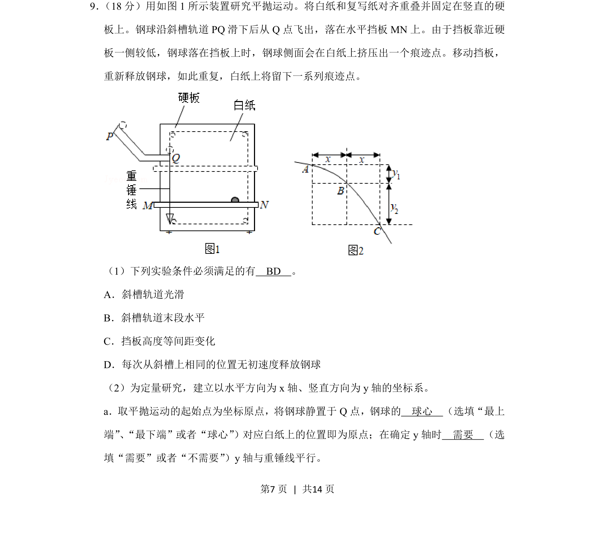
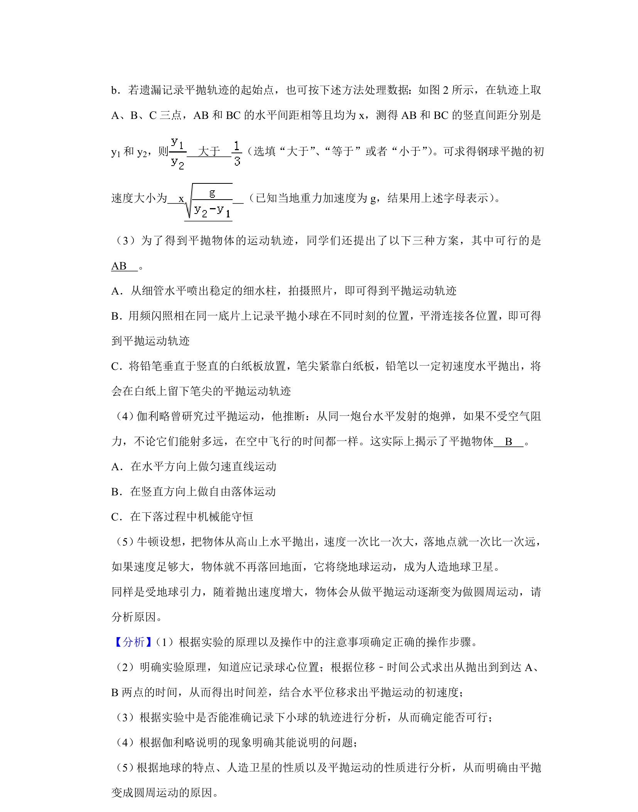
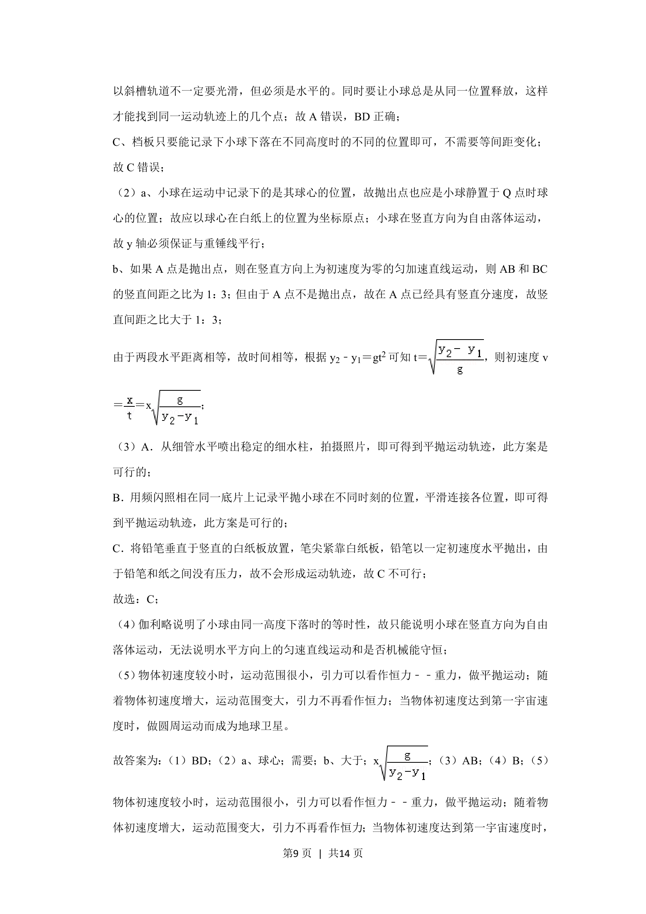
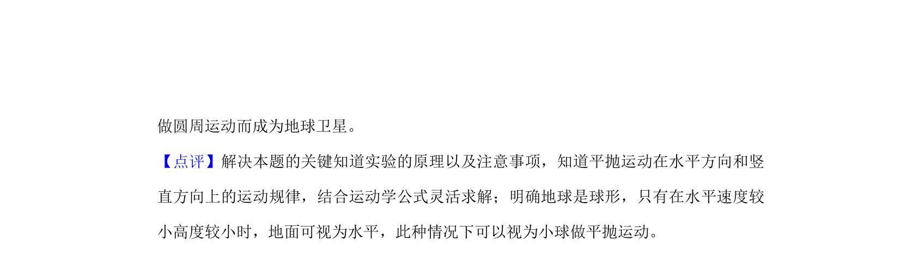

## 题面

## 摘要

探究平抛运动实验，考查运动条件与坐标建立方法

## 关联考点

- [[261-平抛运动|平抛运动]]
- [[实验操作与注意事项]]
- [[坐标系建立]]

## 答案与解析

> 📄 原 PDF 第 7 页：`素材/真题/北京/2008-2024·（北京）物理高考真题/2019年高考物理试卷（北京）（解析卷）.pdf`

<!-- 题干文本-start -->
## 题干文本
9． （18分）用如图1所示装置研究平抛运动。将白纸和复写纸对齐重叠并固定在竖直的硬
板上。钢球沿斜槽轨道PQ滑下后从Q点飞出，落在水平挡板MN上。由于挡板靠近硬
板一侧较低，钢球落在挡板上时，钢球侧面会在白纸上挤压出一个痕迹点。移动挡板，
重新释放钢球，如此重复，白纸上将留下一系列痕迹点。
（1）下列实验条件必须满足的有　BD　。
A．斜槽轨道光滑
B．斜槽轨道末段水平
C．挡板高度等间距变化
D．每次从斜槽上相同的位置无初速度释放钢球
（2）为定量研究，建立以水平方向为x轴、竖直方向为y轴的坐标系。
a．取平抛运动的起始点为坐标原点，将钢球静置于Q点，钢球的　球心　（选填“最上
端”、“最下端”或者“球心”）对应白纸上的位置即为原点；在确定y轴时　需要　（选
填“需要”或者“不需要”）y轴与重锤线平行。
<!-- 题干文本-end -->

<!-- 解析文本-start -->
## 解析文本

<!-- 解析文本-end -->
