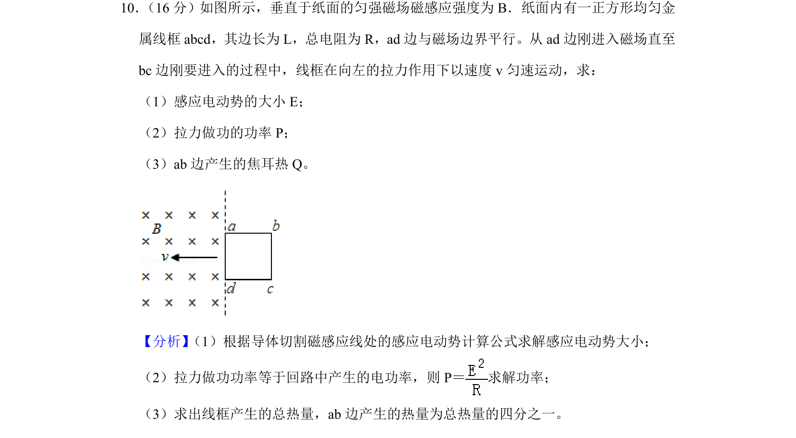
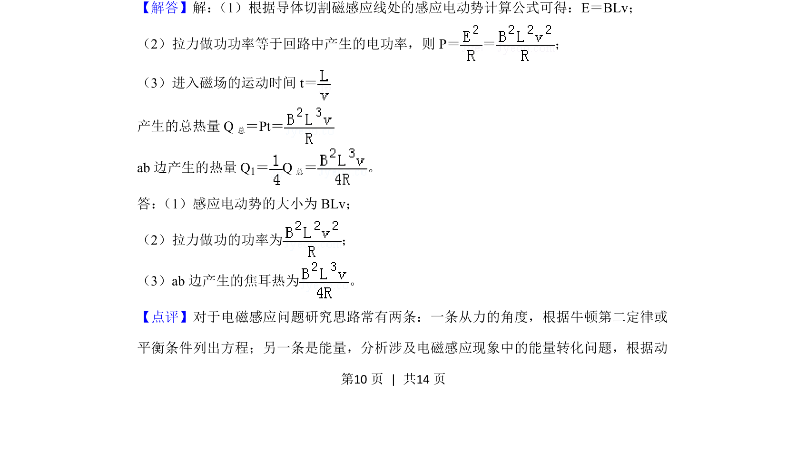

## 题面

## 摘要

导线框匀速进入匀强磁场，计算感应电动势、拉力功率及ab边焦耳热。

## 关联考点

- [[175-电磁感应|电磁感应]]
- [[387-感应电动势|感应电动势]]
- [[159-电功率|电功率]]
- [[173-电热|焦耳热]]

## 答案与解析

> 📄 原 PDF 第 10 页：`素材/真题/北京/2008-2024·（北京）物理高考真题/2019年高考物理试卷（北京）（解析卷）.pdf`
