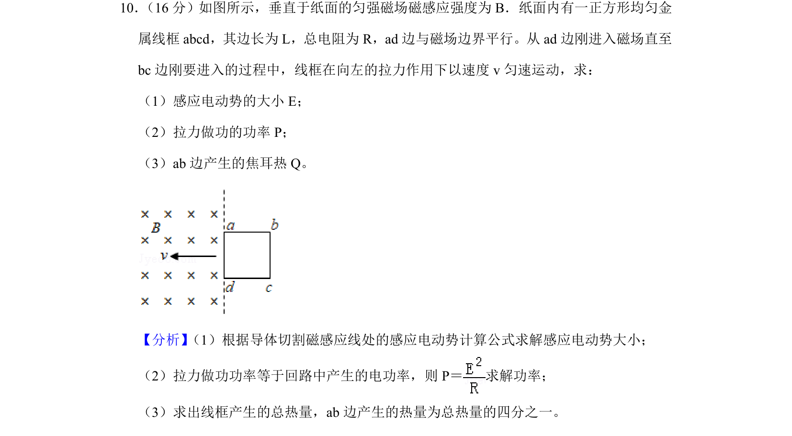
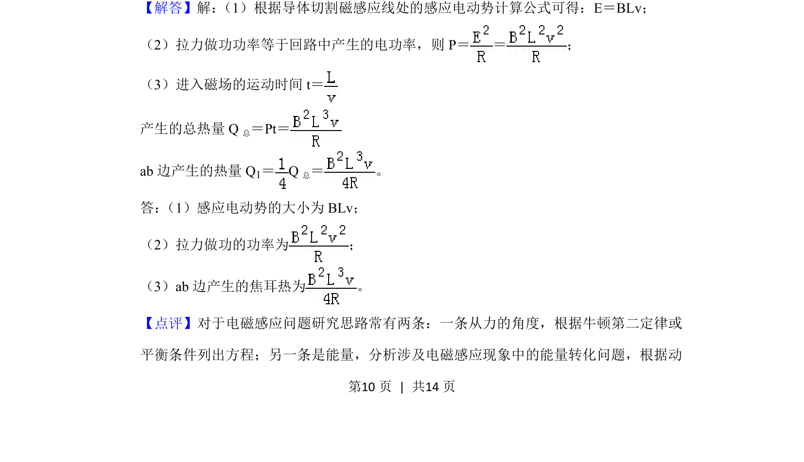

## 题面

## 摘要

导线框匀速进入匀强磁场，计算感应电动势、拉力功率及ab边焦耳热。

## 关联考点

- [[175-电磁感应|电磁感应]]
- [[387-感应电动势|感应电动势]]
- [[159-电功率|电功率]]
- [[173-电热|焦耳热]]

## 答案与解析

> 📄 原 PDF 第 10 页：`素材/真题/北京/2008-2024·（北京）物理高考真题/2019年高考物理试卷（北京）（解析卷）.pdf`

<!-- 题干文本-start -->
## 题干文本
10． （16分）如图所示，垂直于纸面的匀强磁场磁感应强度为B．纸面内有一正方形均匀金
属线框abcd，其边长为L，总电阻为R，ad边与磁场边界平行。从ad边刚进入磁场直至
bc边刚要进入的过程中，线框在向左的拉力作用下以速度v匀速运动，求：
（1）感应电动势的大小E；
（2）拉力做功的功率P；
（3）ab边产生的焦耳热Q。
<!-- 题干文本-end -->

<!-- 解析文本-start -->
## 解析文本
【分析】 （1）根据导体切割磁感应线处的感应电动势计算公式求解感应电动势大小；
（2）拉力做功功率等于回路中产生的电功率，则P＝ 求解功率；
（3）求出线框产生的总热量，ab边产生的热量为总热量的四分之一。
【解答】解： （1）根据导体切割磁感应线处的感应电动势计算公式可得：E＝BLv；
（2）拉力做功功率等于回路中产生的电功率，则P＝ ＝ ；
（3）进入磁场的运动时间t＝
产生的总热量Q 总＝Pt＝
ab边产生的热量Q 1＝Q 总＝ 。
答： （1）感应电动势的大小为BLv；
（2）拉力做功的功率为 ；
（3）ab边产生的焦耳热为 。
【点评】对于电磁感应问题研究思路常有两条：一条从力的角度，根据牛顿第二定律或
平衡条件列出方程；另一条是能量，分析涉及电磁感应现象中的能量转化问题，根据动
<!-- 解析文本-end -->
