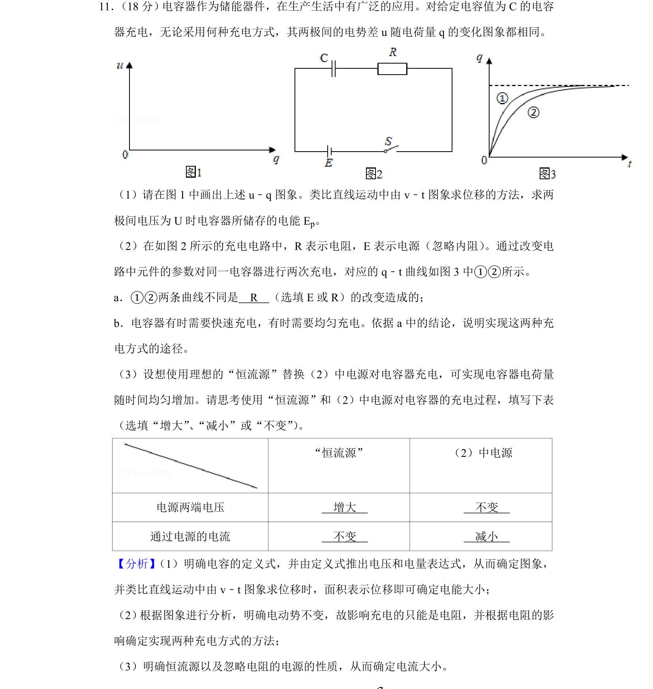
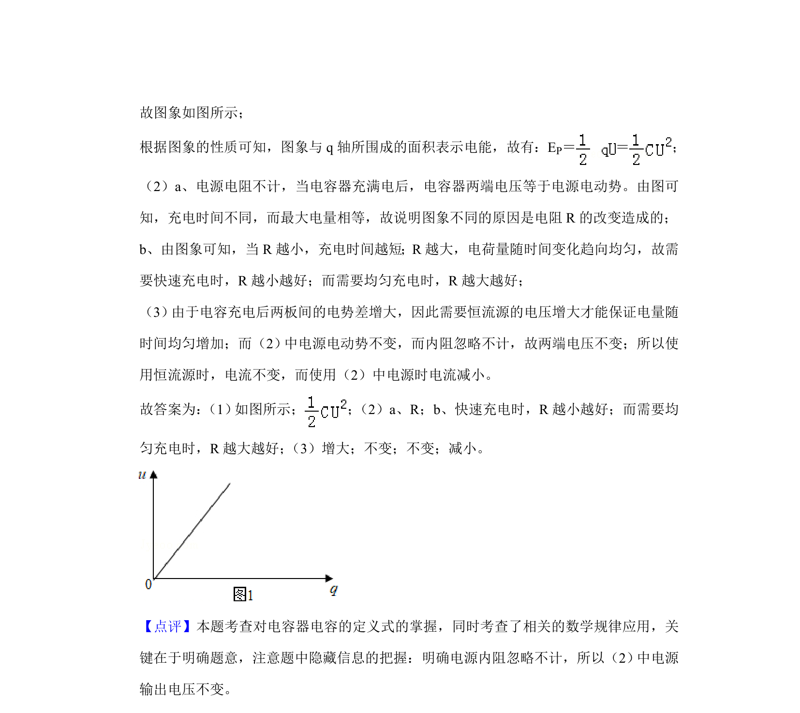

## 题面

## 摘要

本题通过电容器充电过程考查u-q图像、储能计算、RC电路特性及恒流源对比分析。

## 关联考点

- [[313-电容器|电容器]]
- [[678-电容定义式|电容定义式]]
- [[电能计算]]
- [[RC充电电路]]
- [[恒流源]]

## 答案与解析

> 📄 原 PDF 第 11 页：`素材/真题/北京/2008-2024·（北京）物理高考真题/2019年高考物理试卷（北京）（解析卷）.pdf`
