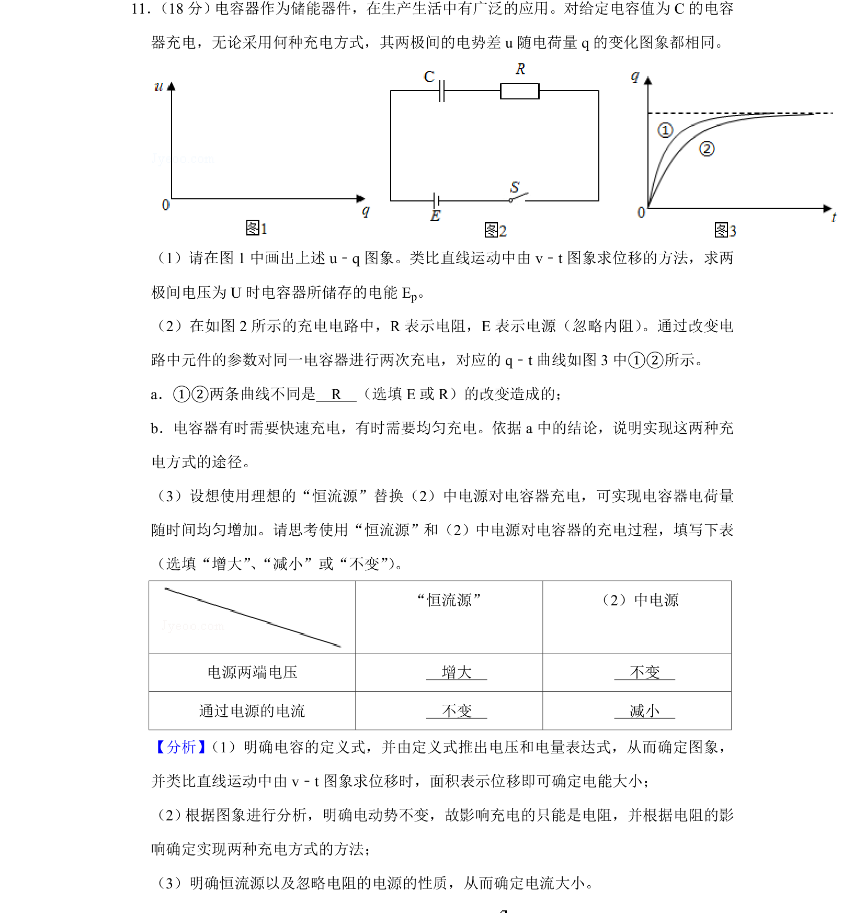
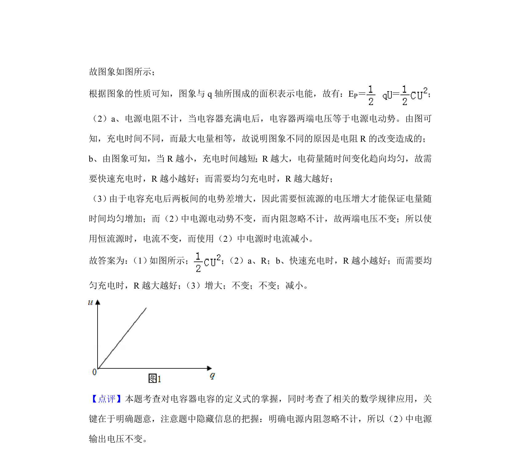

## 题面

## 摘要

本题通过电容器充电过程考查u-q图像、储能计算、RC电路特性及恒流源对比分析。

## 关联考点

- [[313-电容器|电容器]]
- [[678-电容定义式|电容定义式]]
- [[电能计算]]
- [[RC充电电路]]
- [[恒流源]]

## 答案与解析

> 📄 原 PDF 第 11 页：`素材/真题/北京/2008-2024·（北京）物理高考真题/2019年高考物理试卷（北京）（解析卷）.pdf`

<!-- 题干文本-start -->
## 题干文本
11． （18分） 电容器作为储能器件，在生产生活中有广泛的应用。对给定电容值为C的电容
器充电，无论采用何种充电方式，其两极间的电势差u随电荷量q的变化图象都相同。
（1）请在图1中画出上述u﹣q图象。类比直线运动中由v﹣t图象求位移的方法，求两
极间电压为U时电容器所储存的电能E p。
（2）在如图2所示的充电电路中，R表示电阻，E表示电源（忽略内阻） 。通过改变电
路中元件的参数对同一电容器进行两次充电，对应的q﹣t曲线如图3中①②所示。
a．①②两条曲线不同是　R　（选填E或R）的改变造成的；
b．电容器有时需要快速充电，有时需要均匀充电。依据a中的结论，说明实现这两种充
电方式的途径。
（3）设想使用理想的“恒流源”替换（2）中电源对电容器充电，可实现电容器电荷量
随时间均匀增加。请思考使用“恒流源”和（2）中电源对电容器的充电过程，填写下表
（选填“增大”、“减小”或“不变”） 。
“恒流源” （2）中电源
电源两端电压 　增大　 　不变　
通过电源的电流 　不变　 　减小
<!-- 题干文本-end -->

<!-- 解析文本-start -->
## 解析文本
【分析】 （1）明确电容的定义式，并由定义式推出电压和电量表达式，从而确定图象，
并类比直线运动中由v﹣t图象求位移时，面积表示位移即可确定电能大小；
（2） 根据图象进行分析，明确电动势不变，故影响充电的只能是电阻，并根据电阻的影
响确定实现两种充电方式的方法；
（3）明确恒流源以及忽略电阻的电源的性质，从而确定电流大小。
【解答】 解： （1） 根据电容的定义Q＝UC可知，U＝ ，故电压U与电量为正比例关系，
<!-- 解析文本-end -->
