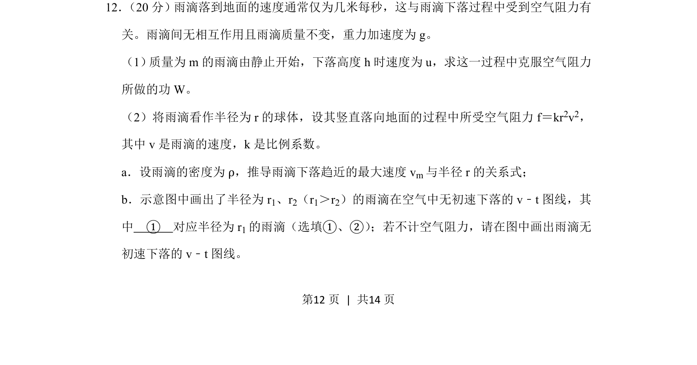
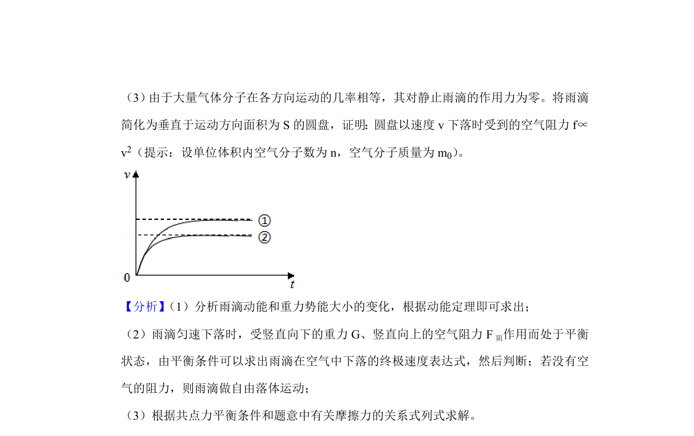
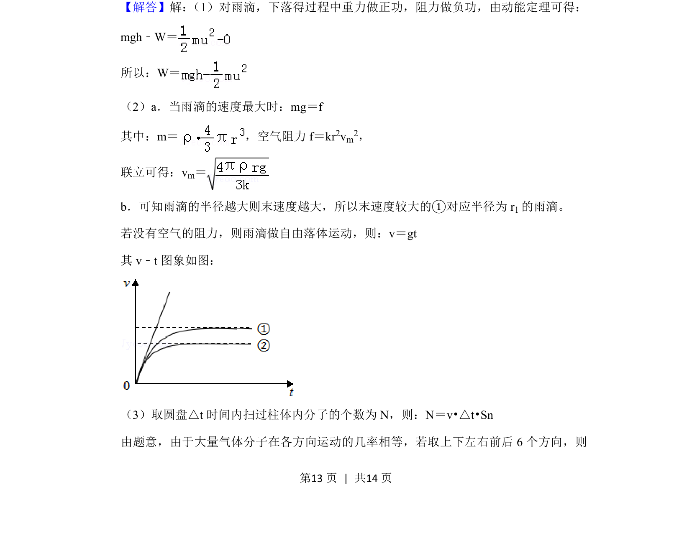
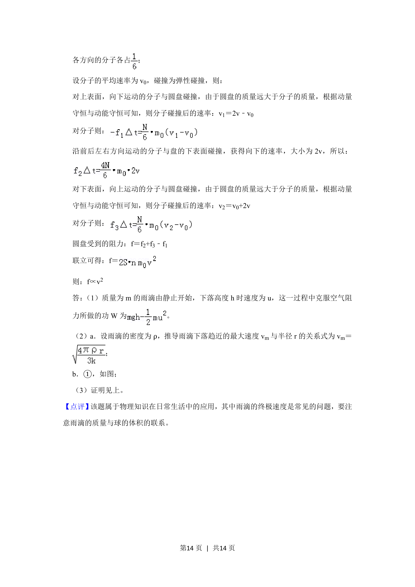

## 题面

## 摘要

本题通过雨滴下落模型考查空气阻力做功、最大速度推导及v-t图线分析。

## 关联考点

- [[251-动能定理|动能定理]]
- [[空气阻力]]
- [[终端速度]]
- [[v-t图线]]

## 答案与解析

> 📄 原 PDF 第 12 页：`素材/真题/北京/2008-2024·（北京）物理高考真题/2019年高考物理试卷（北京）（解析卷）.pdf`
