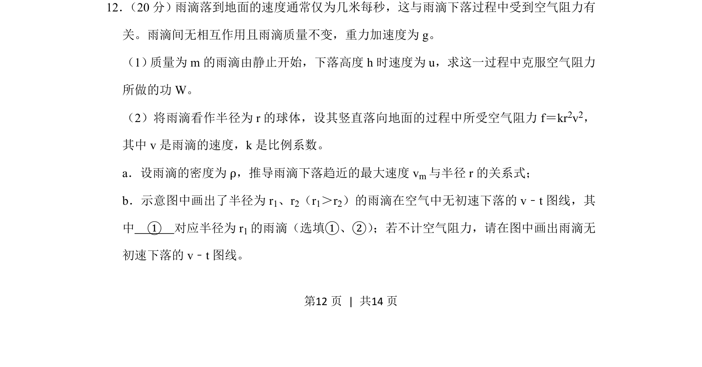
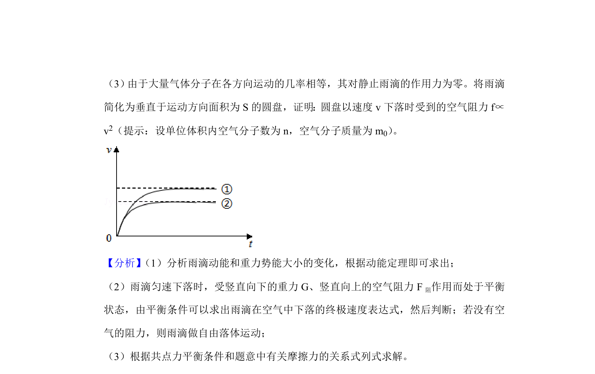
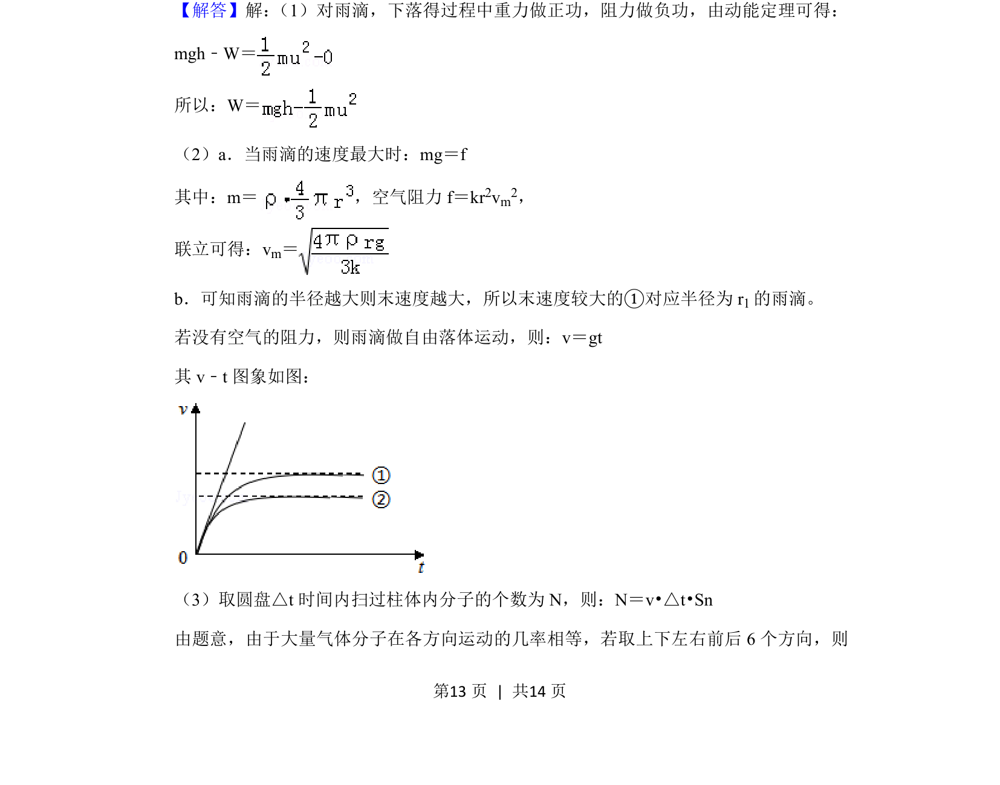
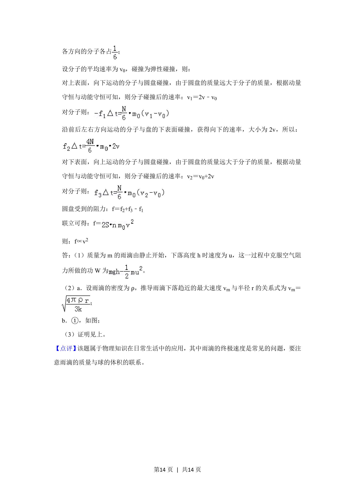

## 题面

## 摘要

本题通过雨滴下落模型考查空气阻力做功、最大速度推导及v-t图线分析。

## 关联考点

- [[251-动能定理|动能定理]]
- [[850-空气阻力|空气阻力]]
- [[终端速度]]
- [[v-t图线]]

## 答案与解析

> 📄 原 PDF 第 12 页：`素材/真题/北京/2008-2024·（北京）物理高考真题/2019年高考物理试卷（北京）（解析卷）.pdf`

<!-- 题干文本-start -->
## 题干文本
12． （20分）雨滴落到地面的速度通常仅为几米每秒，这与雨滴下落过程中受到空气阻力有
关。雨滴间无相互作用且雨滴质量不变，重力加速度为g。
（1） 质量为m的雨滴由静止开始，下落高度h时速度为u，求这一过程中克服空气阻力
所做的功W。
（2）将雨滴看作半径为r的球体，设其竖直落向地面的过程中所受空气阻力f＝kr 2v2，
其中v是雨滴的速度，k是比例系数。
a．设雨滴的密度为ρ，推导雨滴下落趋近的最大速度v m与半径r的关系式；
b．示意图中画出了半径为r 1、r2（r1＞r2）的雨滴在空气中无初速下落的v﹣t图线，其
中　①　对应半径为r 1的雨滴（选填①、②） ；若不计空气阻力，请在图中画出雨滴无
初速下落的v﹣t图线。
<!-- 题干文本-end -->

<!-- 解析文本-start -->
## 解析文本

<!-- 解析文本-end -->
