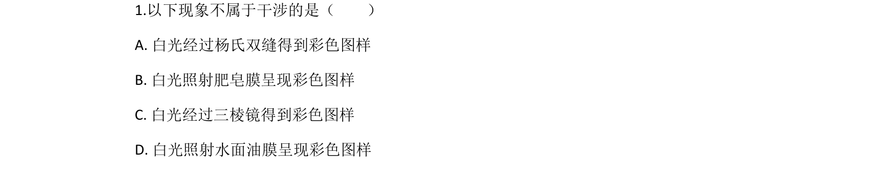
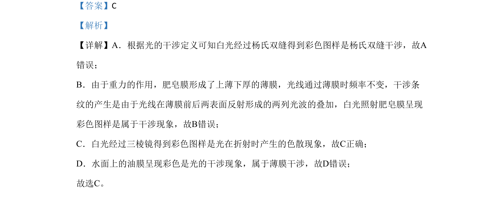

## 题面

## 摘要

考查光的干涉与色散现象辨析，要求判断白光经不同装置形成彩色图样的原理。

## 关联考点

- [[340-光的干涉|光的干涉]]
- [[005-光的色散|色散]]
- [[788-薄膜干涉|薄膜干涉]]
- [[杨氏双缝干涉]]

## 答案与解析

> 📄 原 PDF 第 1 页：`素材/真题/北京/2008-2024·（北京）物理高考真题/2020年高考物理试卷（北京）（解析卷）.pdf`
