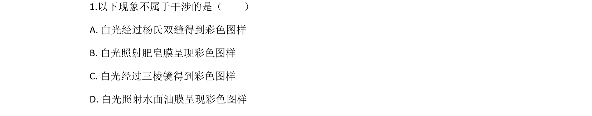
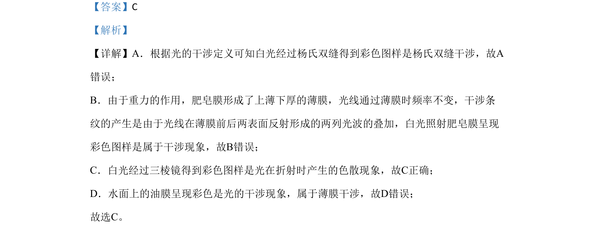

## 题面

## 摘要

考查光的干涉与色散现象辨析，要求判断白光经不同装置形成彩色图样的原理。

## 关联考点

- [[340-光的干涉|光的干涉]]
- [[005-光的色散|色散]]
- [[787-薄膜干涉|薄膜干涉]]
- [[杨氏双缝干涉]]

## 答案与解析

> 📄 原 PDF 第 1 页：`素材/真题/北京/2008-2024·（北京）物理高考真题/2020年高考物理试卷（北京）（解析卷）.pdf`

<!-- 题干文本-start -->
## 题干文本
1.以下现象不属于干涉的是（　　）
A. 白光经过杨氏双缝得到彩色图样
B. 白光照射肥皂膜呈现彩色图样
C. 白光经过三棱镜得到彩色图样
D. 白光照射水面油膜呈现彩色图样
<!-- 题干文本-end -->

<!-- 解析文本-start -->
## 解析文本
【答案】C
【解析】
【详解】A．根据光的干涉定义可知白光经过杨氏双缝得到彩色图样是杨氏双缝干涉，故A
错误；
B．由于重力的作用，肥皂膜形成了上薄下厚的薄膜，光线通过薄膜时频率不变，干涉条
纹的产生是由于光线在薄膜前后两表面反射形成的两列光波的叠加，白光照射肥皂膜呈现
彩色图样是属于干涉现象，故B错误；
C．白光经过三棱镜得到彩色图样是光在折射时产生的色散现象，故C正确；
D．水面上的油膜呈现彩色是光的干涉现象，属于薄膜干涉，故D错误；
故选C。
<!-- 解析文本-end -->
