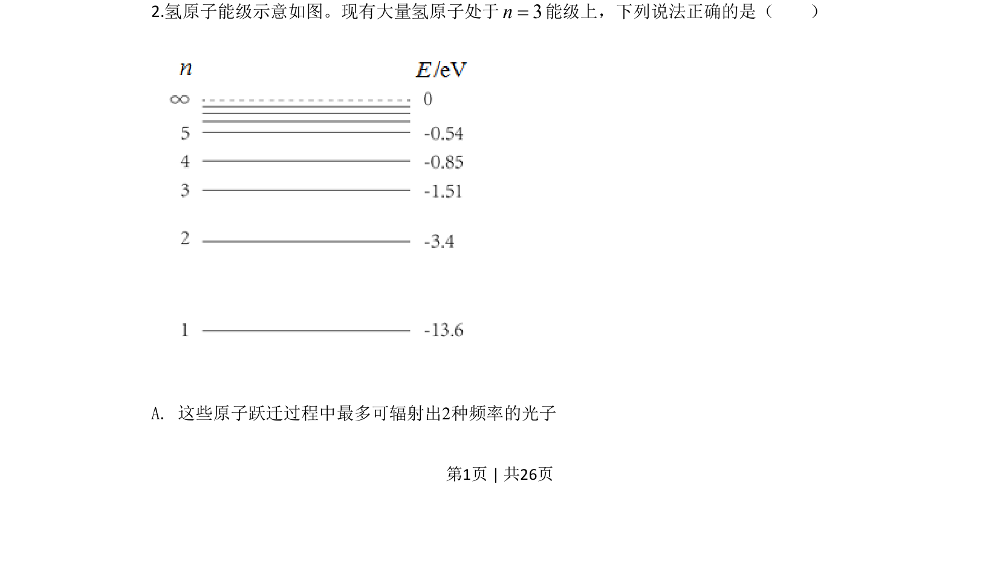
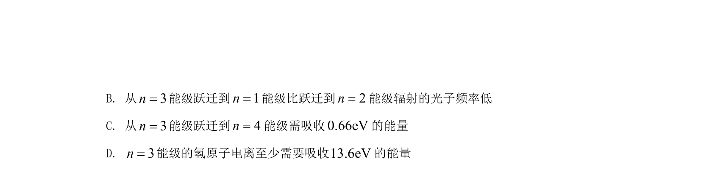
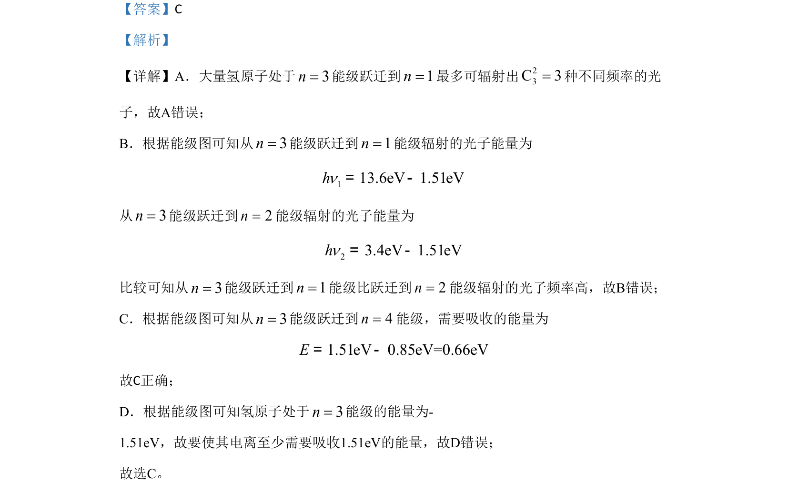

## 题面

## 摘要

氢原子能级跃迁与电离问题，判断辐射光子种类、频率高低及电离所需能量。

## 关联考点

- [[436-氢原子能级|氢原子能级]]
- [[跃迁]]
- [[453-光子能量|光子能量]]
- [[166-电离|电离]]

## 答案与解析

> 📄 原 PDF 第 1 页：`素材/真题/北京/2008-2024·（北京）物理高考真题/2020年高考物理试卷（北京）（解析卷）.pdf`
