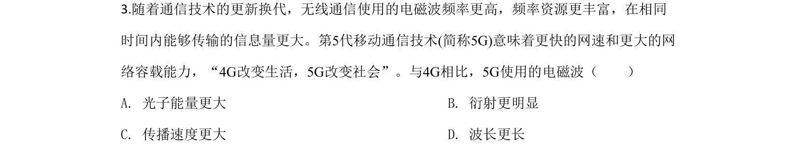
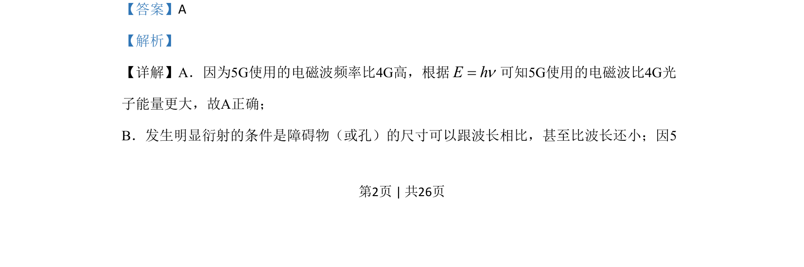
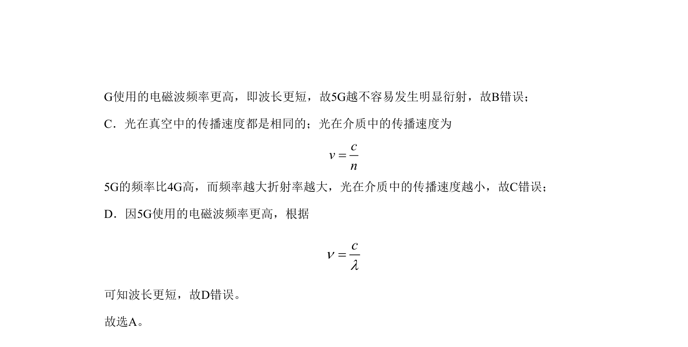

## 题面

## 摘要

比较5G与4G电磁波的频率、波长、光子能量、衍射及传播速度差异。

## 关联考点

- [[453-光子能量|光子能量]]
- [[479-波长与频率关系|波长与频率关系]]
- [[明显衍射条件]]
- [[介质中光速]]

## 答案与解析

> 📄 原 PDF 第 2 页：`素材/真题/北京/2008-2024·（北京）物理高考真题/2020年高考物理试卷（北京）（解析卷）.pdf`
