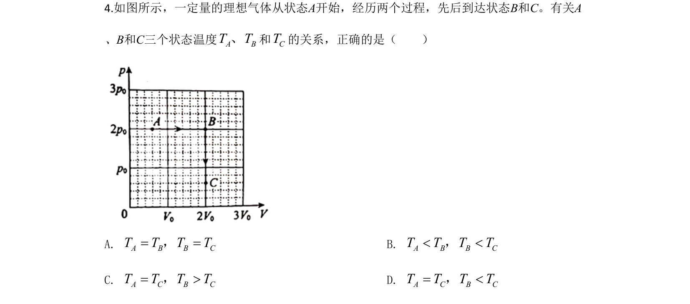
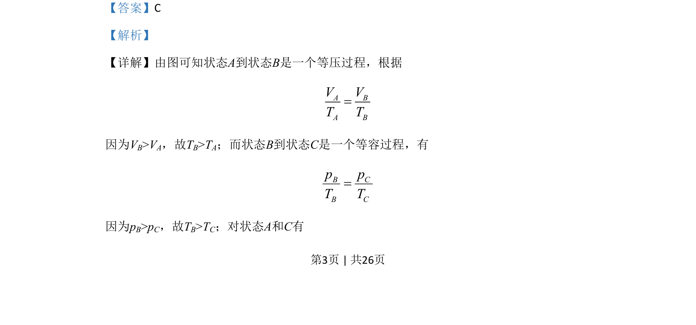

## 题面

## 摘要

考查理想气体的等压与等容过程，利用气体实验定律比较不同状态的温度。

## 关联考点

- [[445-理想气体|理想气体]]
- [[708-等压过程|等压过程]]
- [[等容过程]]
- [[638-气体实验定律|气体实验定律]]

## 答案与解析

> 📄 原 PDF 第 3 页：`素材/真题/北京/2008-2024·（北京）物理高考真题/2020年高考物理试卷（北京）（解析卷）.pdf`
