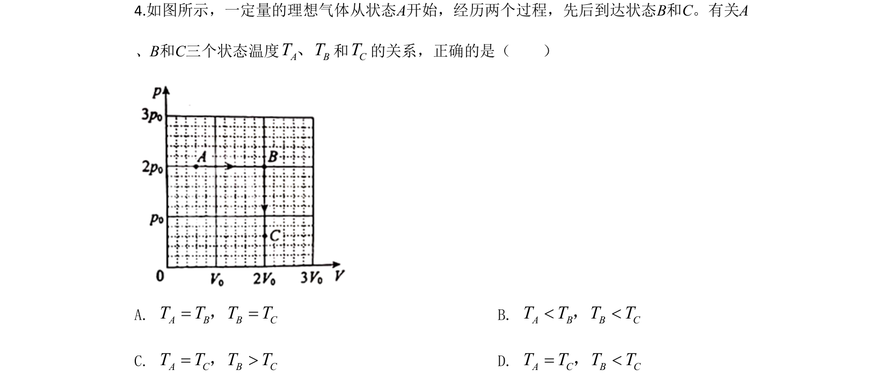
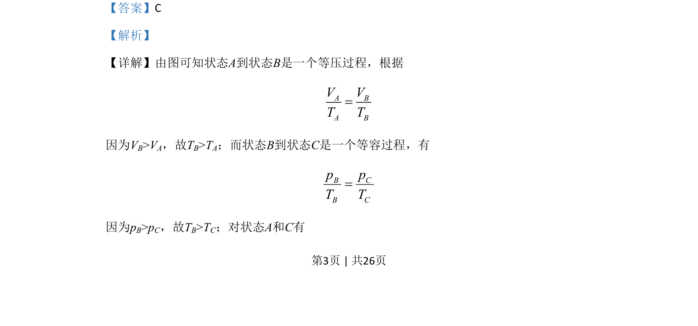

## 题面

## 摘要

考查理想气体的等压与等容过程，利用气体实验定律比较不同状态的温度。

## 关联考点

- [[445-理想气体|理想气体]]
- [[708-等压过程|等压过程]]
- [[等容过程]]
- [[638-气体实验定律|气体实验定律]]

## 答案与解析

> 📄 原 PDF 第 3 页：`素材/真题/北京/2008-2024·（北京）物理高考真题/2020年高考物理试卷（北京）（解析卷）.pdf`

<!-- 题干文本-start -->
## 题干文本
4.如图所示，一定量的理想气体从状态A开始，经历两个过程，先后到达状态B和C。有关A
、B和C三个状态温度A BT T、和CT的关系，正确的是（　　）
A. A B B CT T T T= =，B. A B B CT T T T< <，
C. A C B CT T T T= >，D. A C B CT T T T= <，
<!-- 题干文本-end -->

<!-- 解析文本-start -->
## 解析文本
【答案】C
【解析】
【详解】由图可知状态A到状态B是一个等压过程，根据
A BA BV VT T=
因为VB>VA，故TB>TA；而状态B到状态C是一个等容过程，有
CBB CppT T=
因为pB>pC，故TB>TC；对状态A和C有
<!-- 解析文本-end -->
