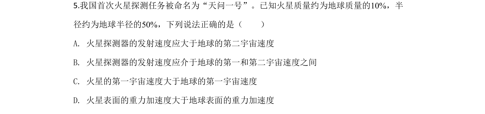
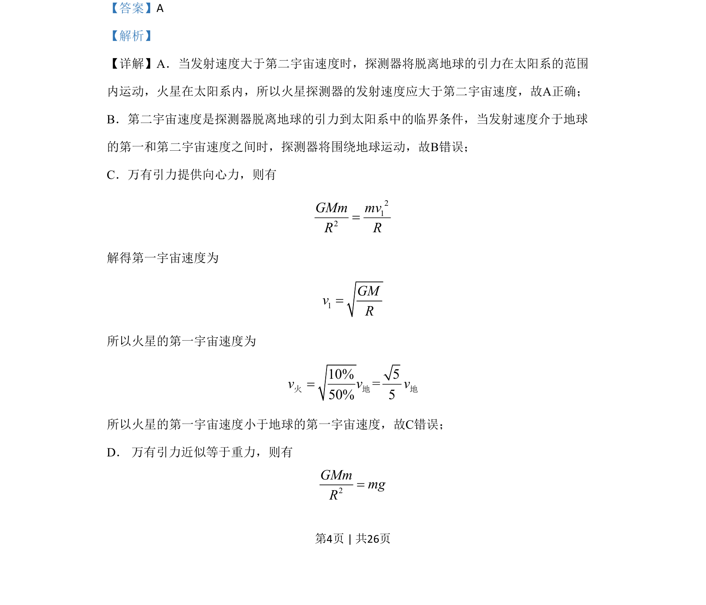
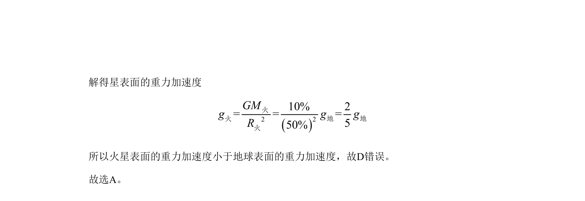

## 题面

## 摘要

比较地球与火星的宇宙速度和重力加速度。

## 关联考点

- [[第二宇宙速度]]
- [[281-第一宇宙速度|第一宇宙速度]]
- [[246-万有引力定律|万有引力定律]]
- [[115-重力加速度-初中|重力加速度]]

## 答案与解析

> 📄 原 PDF 第 4 页：`素材/真题/北京/2008-2024·（北京）物理高考真题/2020年高考物理试卷（北京）（解析卷）.pdf`
