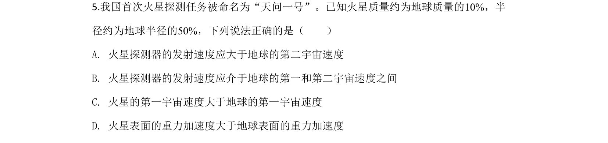
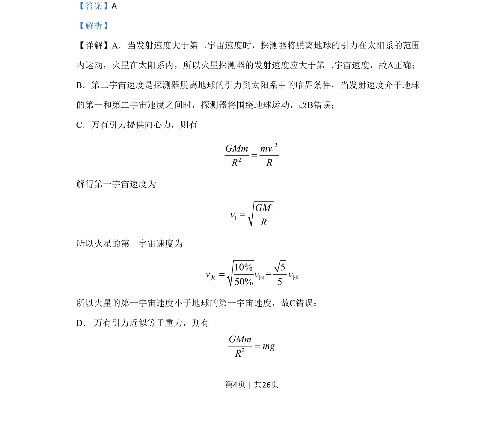
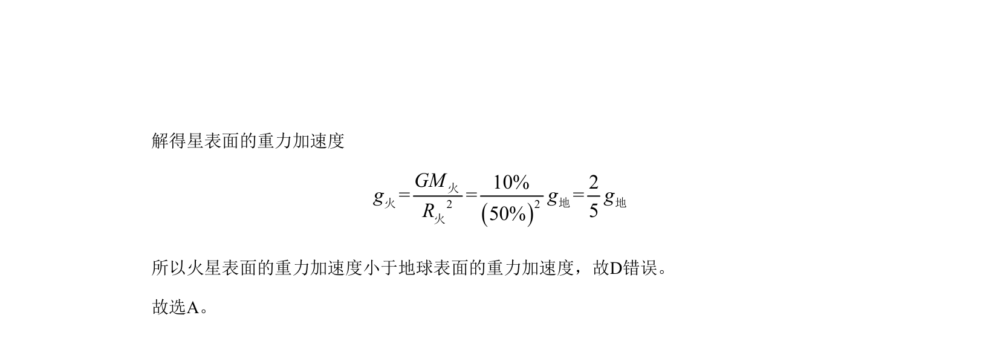

## 题面

## 摘要

比较地球与火星的宇宙速度和重力加速度。

## 关联考点

- [[851-第二宇宙速度|第二宇宙速度]]
- [[281-第一宇宙速度|第一宇宙速度]]
- [[246-万有引力定律|万有引力定律]]
- [[115-重力加速度-初中|重力加速度]]

## 答案与解析

> 📄 原 PDF 第 4 页：`素材/真题/北京/2008-2024·（北京）物理高考真题/2020年高考物理试卷（北京）（解析卷）.pdf`

<!-- 题干文本-start -->
## 题干文本
5.我国首次火星探测任务被命名为“天问一号”。已知火星质量约为地球质量的10%，半
径约为地球半径的50%，下列说法正确的是（　　）
A. 火星探测器的发射速度应大于地球的第二宇宙速度
B. 火星探测器的发射速度应介于地球的第一和第二宇宙速度之间
C. 火星的第一宇宙速度大于地球的第一宇宙速度
D. 火星表面的重力加速度大于地球表面的重力加速度
<!-- 题干文本-end -->

<!-- 解析文本-start -->
## 解析文本
【答案】A
【解析】
【详解】A．当发射速度大于第二宇宙速度时，探测器将脱离地球的引力在太阳系的范围
内运动，火星在太阳系内，所以火星探测器的发射速度应大于第二宇宙速度，故A正确；
B．第二宇宙速度是探测器脱离地球的引力到太阳系中的临界条件，当发射速度介于地球
的第一和第二宇宙速度之间时，探测器将围绕地球运动，故B错误；
C．万有引力提供向心力，则有
212mvGMmR R=
解得第一宇宙速度为
1GMvR=
所以火星的第一宇宙速度为
10% 5=50% 5v v v=地地火
所以火星的第一宇宙速度小于地球的第一宇宙速度，故C错误；
D． 万有引力近似等于重力，则有
2GMmmgR=
<!-- 解析文本-end -->
