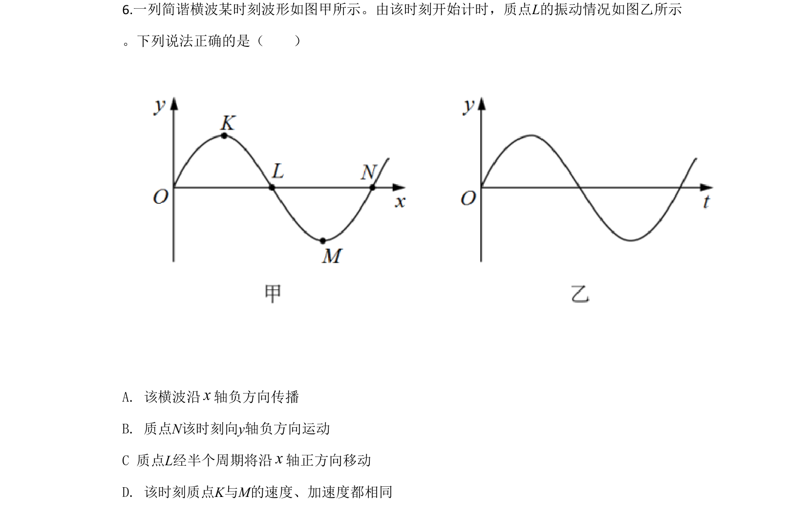
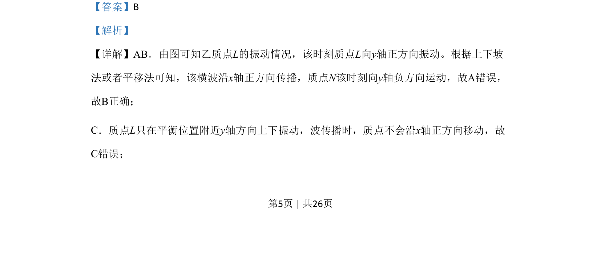

## 题面

## 摘要

根据波形图判断横波传播方向及质点振动方向，考查质点不随波迁移、加速度方向等概念。

## 关联考点

- [[横波传播方向]]
- [[764-质点振动方向|质点振动方向]]
- [[机械波质点运动特点]]

## 答案与解析

> 📄 原 PDF 第 5 页：`素材/真题/北京/2008-2024·（北京）物理高考真题/2020年高考物理试卷（北京）（解析卷）.pdf`
