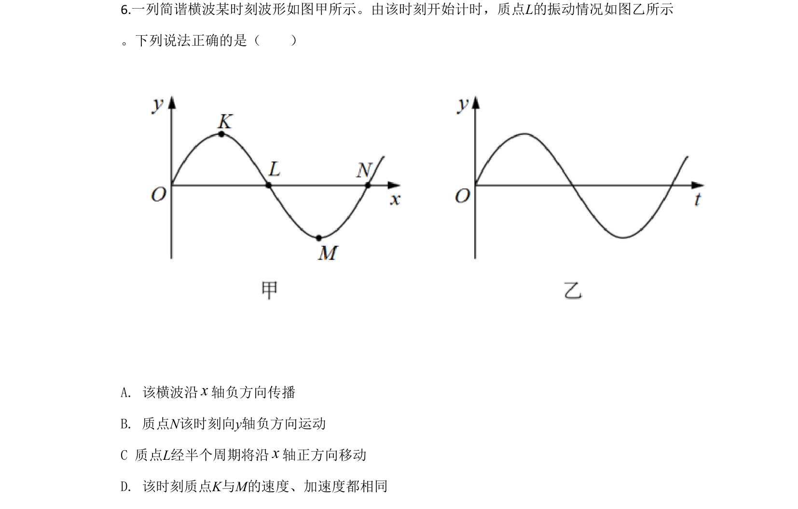
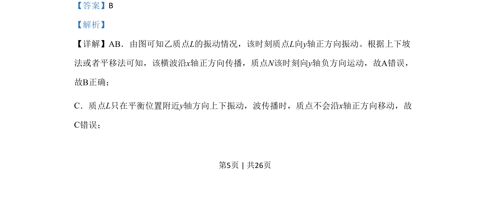
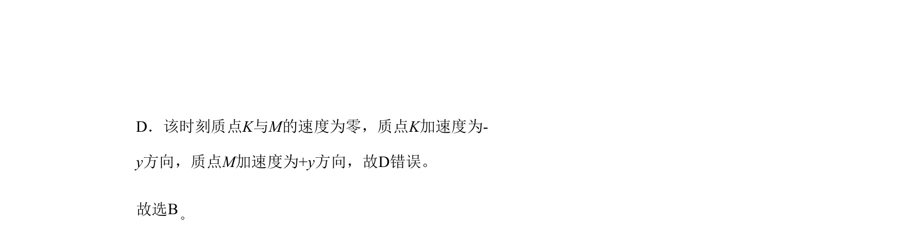

## 题面

## 摘要

根据波形图判断横波传播方向及质点振动方向，考查质点不随波迁移、加速度方向等概念。

## 关联考点

- [[横波传播方向]]
- [[764-质点振动方向|质点振动方向]]
- [[机械波质点运动特点]]

## 答案与解析

> 📄 原 PDF 第 5 页：`素材/真题/北京/2008-2024·（北京）物理高考真题/2020年高考物理试卷（北京）（解析卷）.pdf`

<!-- 题干文本-start -->
## 题干文本
6.一列简谐横波某时刻波形如图甲所示。由该时刻开始计时，质点L的振动情况如图乙所示
。下列说法正确的是（　　）
A. 该横波沿x轴负方向传播
B. 质点N该时刻向y轴负方向运动
C 质点L经半个周期将沿x轴正方向移动
D. 该时刻质点K与M的速度、加速度都相同
<!-- 题干文本-end -->

<!-- 解析文本-start -->
## 解析文本
【答案】B
【解析】
【详解】AB．由图可知乙质点L的振动情况，该时刻质点L向y轴正方向振动。根据上下坡
法或者平移法可知，该横波沿x轴正方向传播，质点N该时刻向y轴负方向运动，故A错误，
故B正确；
C．质点L只在平衡位置附近y轴方向上下振动，波传播时，质点不会沿x轴正方向移动，故
C错误；
<!-- 解析文本-end -->
