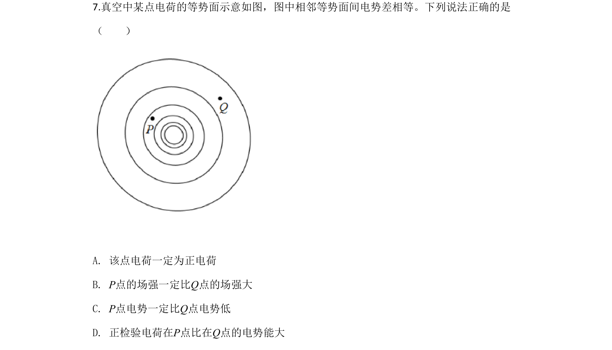
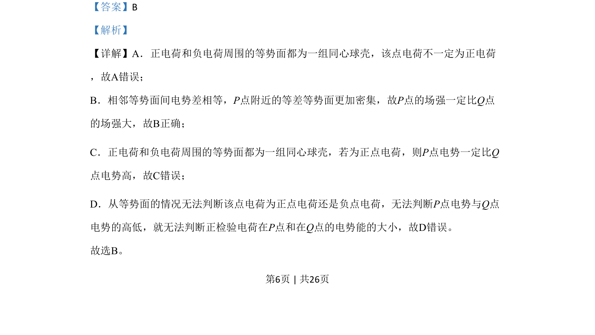

## 题面

## 摘要

该题通过点电荷等势面分布，判断场强、电势及电势能的关系。

## 关联考点

- [[282-等势面|等势面]]
- [[277-电场强度|电场强度]]
- [[308-电势|电势]]
- [[276-电势能|电势能]]

## 答案与解析

> 📄 原 PDF 第 6 页：`素材/真题/北京/2008-2024·（北京）物理高考真题/2020年高考物理试卷（北京）（解析卷）.pdf`
