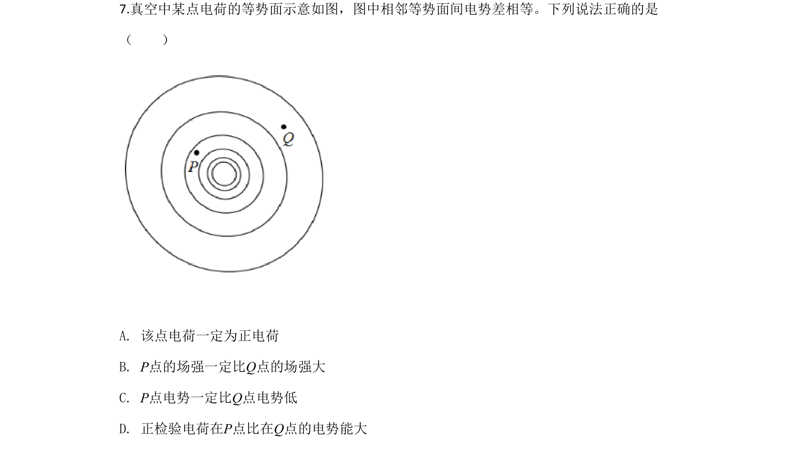
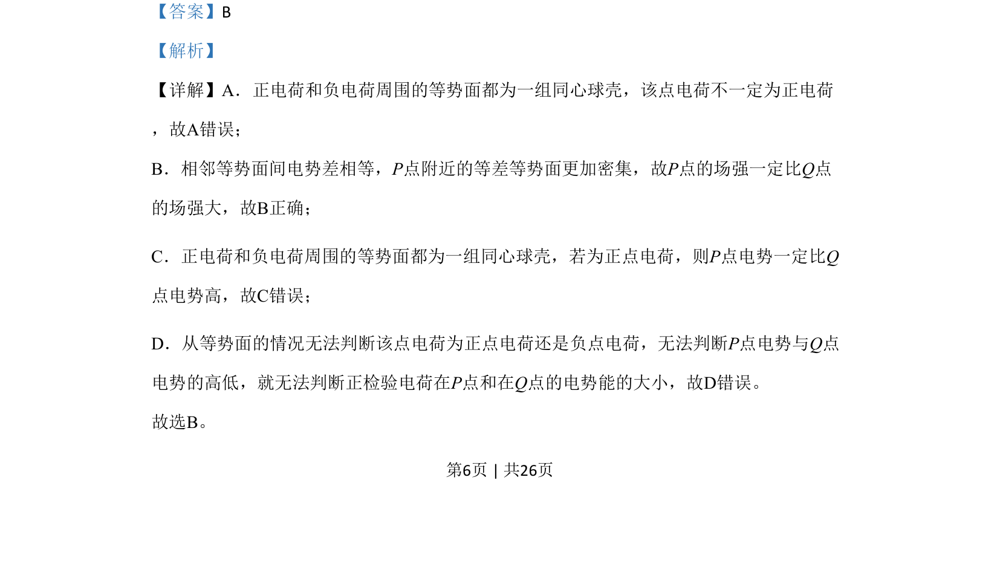

## 题面

## 摘要

该题通过点电荷等势面分布，判断场强、电势及电势能的关系。

## 关联考点

- [[282-等势面|等势面]]
- [[277-电场强度|电场强度]]
- [[308-电势|电势]]
- [[276-电势能|电势能]]

## 答案与解析

> 📄 原 PDF 第 6 页：`素材/真题/北京/2008-2024·（北京）物理高考真题/2020年高考物理试卷（北京）（解析卷）.pdf`

<!-- 题干文本-start -->
## 题干文本
7.真空中某点电荷的等势面示意如图，图中相邻等势面间电势差相等。下列说法正确的是
（　　）
A. 该点电荷一定为正电荷
B. P点的场强一定比Q点的场强大
C. P点电势一定比Q点电势低
D. 正检验电荷在P点比在Q点的电势能大
<!-- 题干文本-end -->

<!-- 解析文本-start -->
## 解析文本
【答案】B
【解析】
【详解】A．正电荷和负电荷周围的等势面都为一组同心球壳，该点电荷不一定为正电荷
，故A错误；
B．相邻等势面间电势差相等，P点附近的等差等势面更加密集，故P点的场强一定比Q点
的场强大，故B正确；
C．正电荷和负电荷周围的等势面都为一组同心球壳，若为正点电荷，则P点电势一定比Q
点电势高，故C错误；
D．从等势面的情况无法判断该点电荷为正点电荷还是负点电荷，无法判断P点电势与Q点
电势的高低，就无法判断正检验电荷在P点和在Q点的电势能的大小，故D错误。
故选B。
。
<!-- 解析文本-end -->
