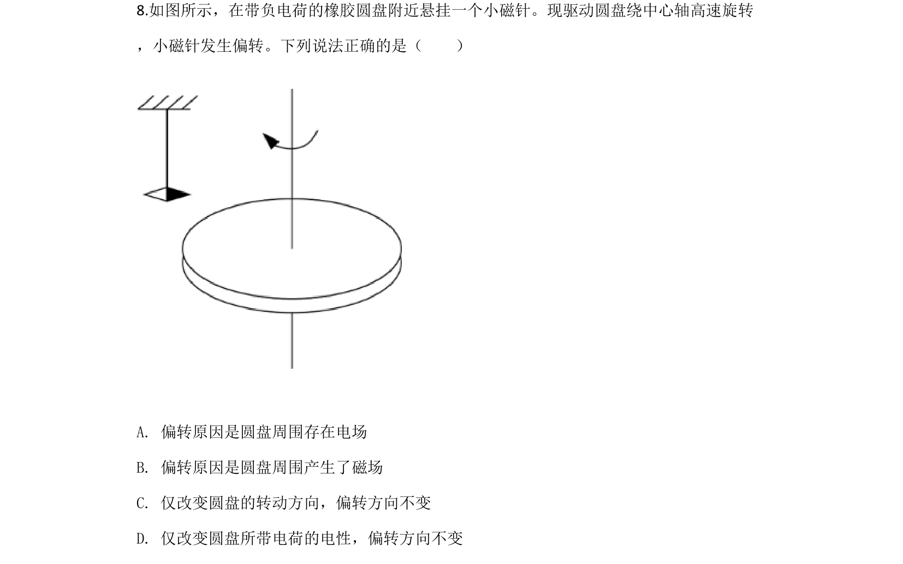
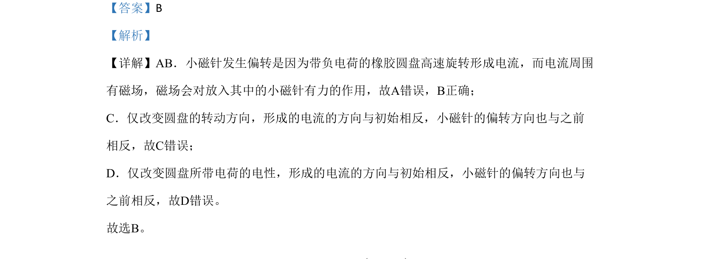

## 题面

## 摘要

橡胶圆盘带电旋转形成电流产生磁场使小磁针偏转，考查电流方向与磁场方向的关系。

## 关联考点

- [[电流的磁场]]
- [[135-安培定则|安培定则]]
- [[磁场对磁极的作用]]

## 答案与解析

> 📄 原 PDF 第 7 页：`素材/真题/北京/2008-2024·（北京）物理高考真题/2020年高考物理试卷（北京）（解析卷）.pdf`

<!-- 题干文本-start -->
## 题干文本
8.如图所示，在带负电荷的橡胶圆盘附近悬挂一个小磁针。现驱动圆盘绕中心轴高速旋转
，小磁针发生偏转。下列说法正确的是（　　）
A. 偏转原因是圆盘周围存在电场
B. 偏转原因是圆盘周围产生了磁场
C. 仅改变圆盘的转动方向，偏转方向不变
D. 仅改变圆盘所带电荷的电性，偏转方向不变
<!-- 题干文本-end -->

<!-- 解析文本-start -->
## 解析文本
【答案】B
【解析】
【详解】AB．小磁针发生偏转是因为带负电荷的橡胶圆盘高速旋转形成电流，而电流周围
有磁场，磁场会对放入其中的小磁针有力的作用，故A错误，B正确；
C．仅改变圆盘的转动方向，形成的电流的方向与初始相反，小磁针的偏转方向也与之前
相反，故C错误；
D．仅改变圆盘所带电荷的电性，形成的电流的方向与初始相反，小磁针的偏转方向也与
之前相反，故D错误。
故选B。
<!-- 解析文本-end -->
