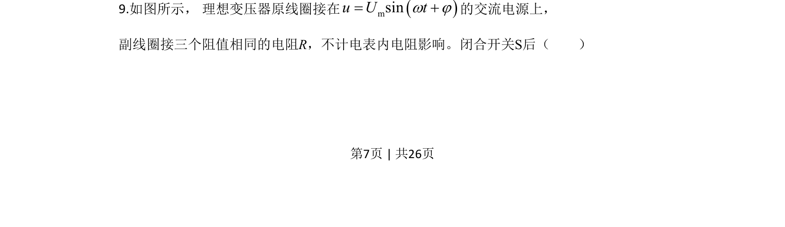
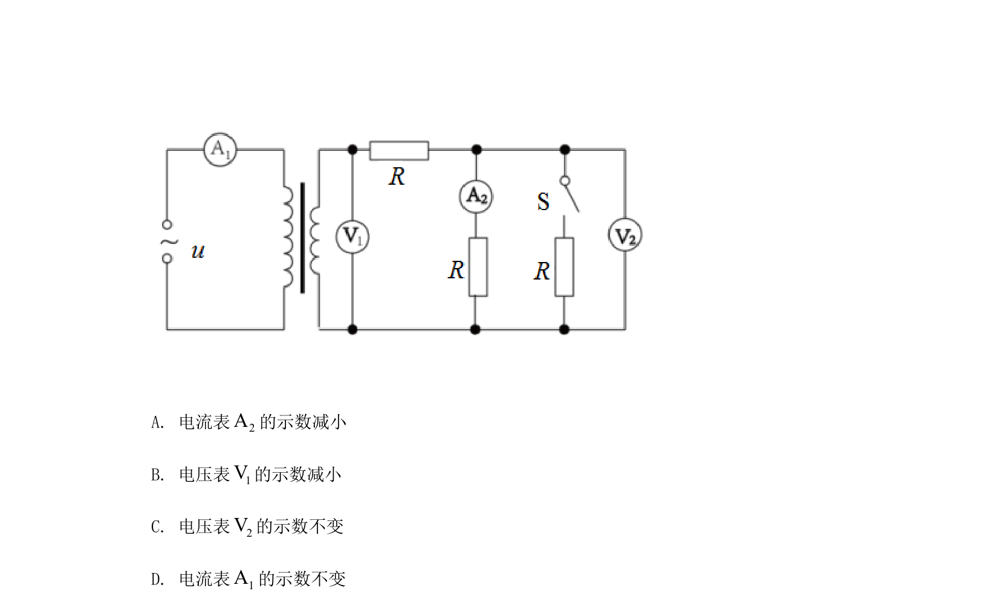
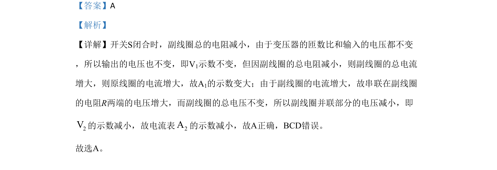

## 题面

## 摘要

理想变压器动态分析，开关闭合导致副线圈电阻减小，进而分析各电表示数变化。

## 关联考点

- [[398-理想变压器|理想变压器]]
- [[动态电路]]
- [[141-欧姆定律-初中|欧姆定律]]
- [[862-并联分流|并联分流]]

## 答案与解析

> 📄 原 PDF 第 7 页：`素材/真题/北京/2008-2024·（北京）物理高考真题/2020年高考物理试卷（北京）（解析卷）.pdf`
