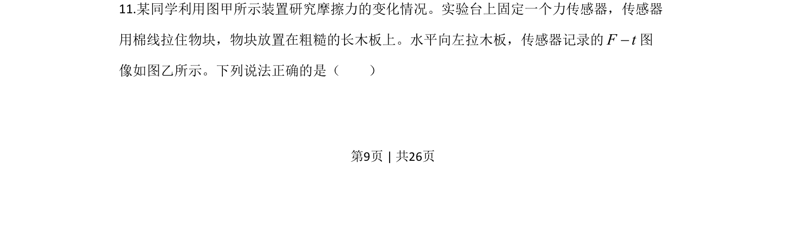
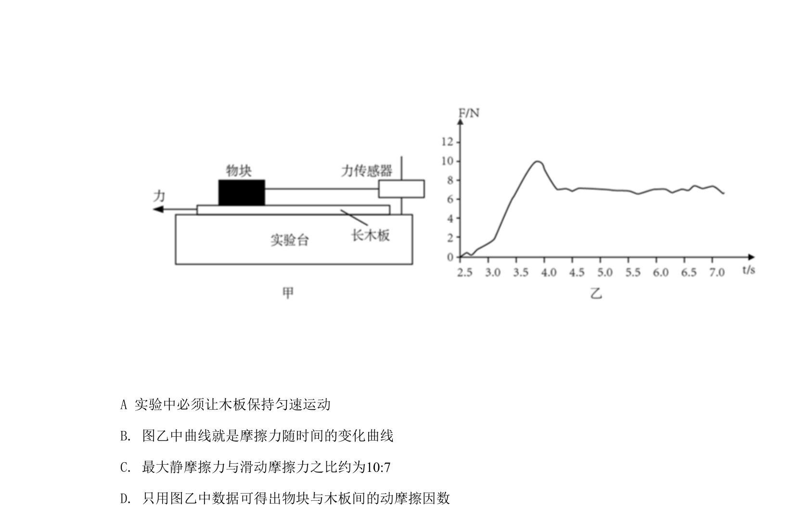
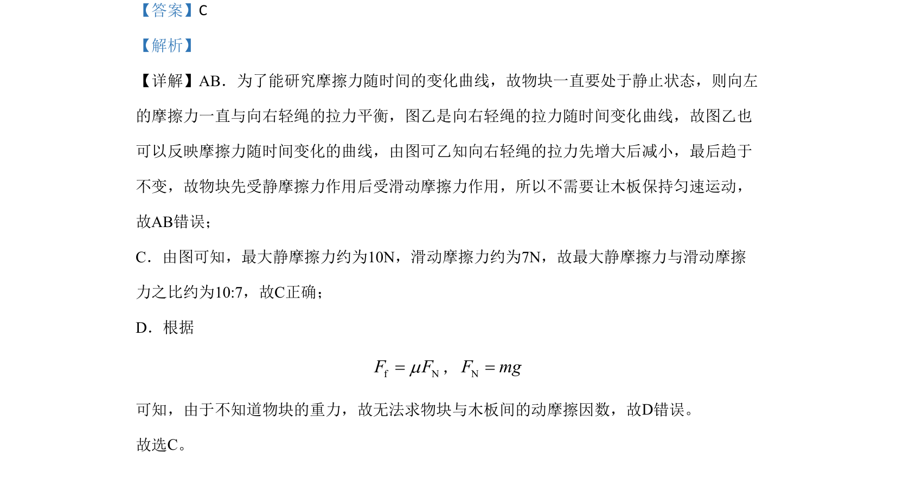

## 题面

## 摘要

考查通过拉力-时间图像分析物块所受静摩擦力与滑动摩擦力的变化，并计算最大静摩擦力与滑动摩擦力之比。

## 关联考点

- [[120-静摩擦力-初中|静摩擦力]]
- [[097-滑动摩擦力|滑动摩擦力]]
- [[777-最大静摩擦力|最大静摩擦力]]
- [[537-动摩擦因数|动摩擦因数]]

## 答案与解析

> 📄 原 PDF 第 9 页：`素材/真题/北京/2008-2024·（北京）物理高考真题/2020年高考物理试卷（北京）（解析卷）.pdf`
