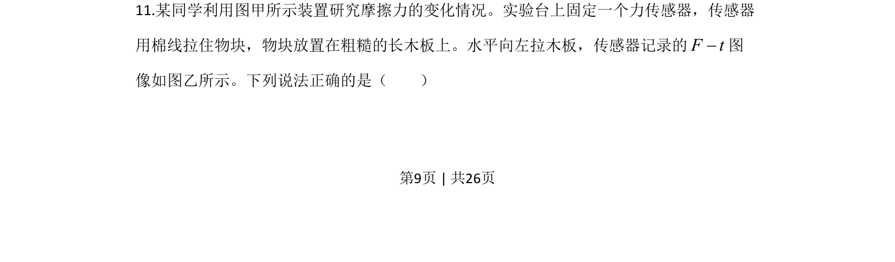
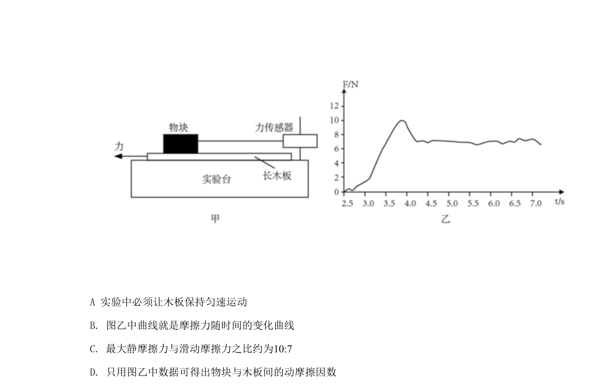
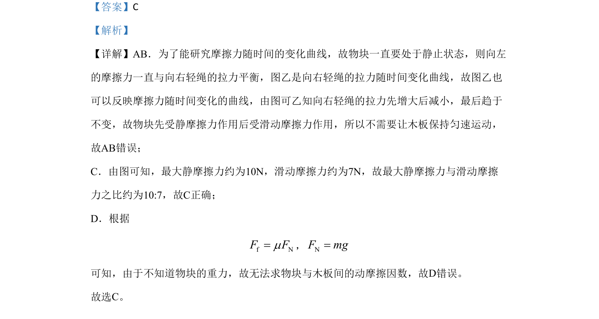

## 题面

## 摘要

考查通过拉力-时间图像分析物块所受静摩擦力与滑动摩擦力的变化，并计算最大静摩擦力与滑动摩擦力之比。

## 关联考点

- [[120-静摩擦力-初中|静摩擦力]]
- [[097-滑动摩擦力|滑动摩擦力]]
- [[776-最大静摩擦力|最大静摩擦力]]
- [[537-动摩擦因数|动摩擦因数]]

## 答案与解析

> 📄 原 PDF 第 9 页：`素材/真题/北京/2008-2024·（北京）物理高考真题/2020年高考物理试卷（北京）（解析卷）.pdf`

<!-- 题干文本-start -->
## 题干文本
11.某同学利用图甲所示装置研究摩擦力的变化情况。实验台上固定一个力传感器，传感器
用棉线拉住物块，物块放置在粗糙的长木板上。水平向左拉木板，传感器记录的F t-图
像如图乙所示。下列说法正确的是（　　）
<!-- 题干文本-end -->

<!-- 解析文本-start -->
## 解析文本

<!-- 解析文本-end -->
