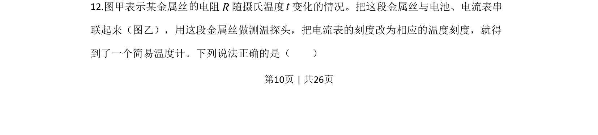
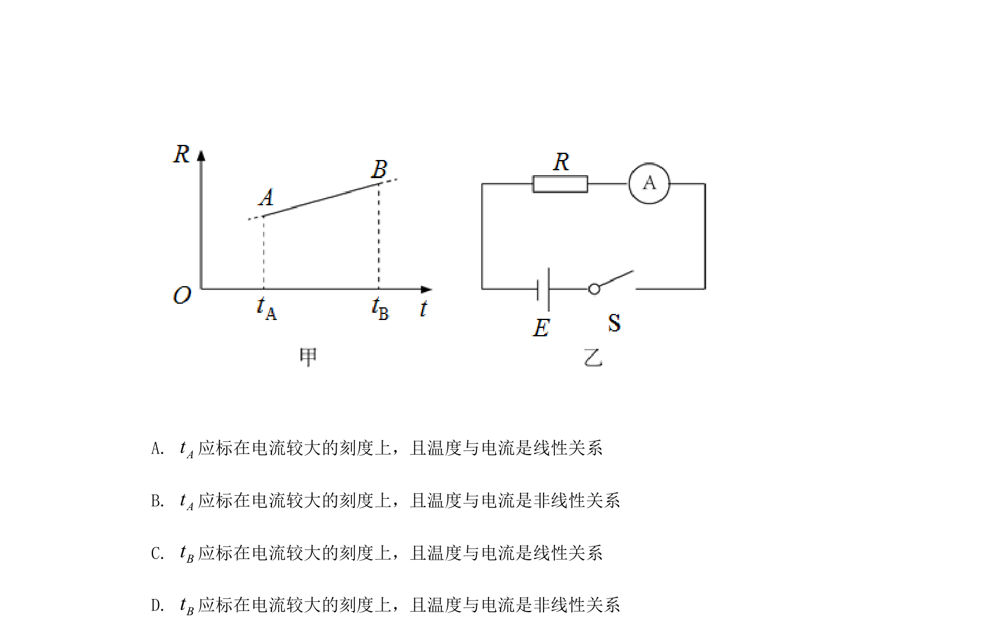
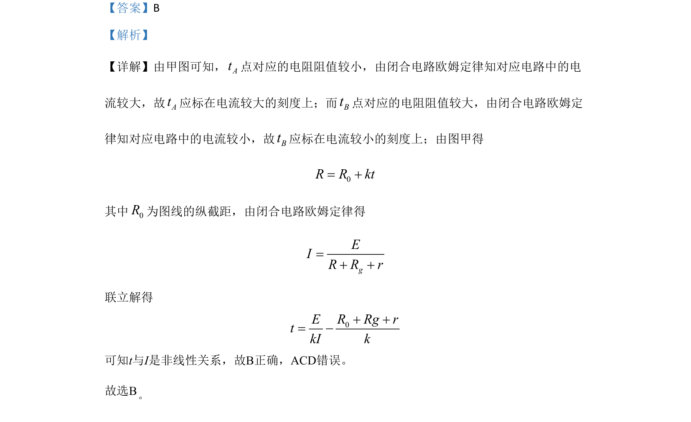

## 题面

## 摘要

该题通过电阻温度图像与闭合电路欧姆定律，分析电流与温度的非线性关系，判断刻度标注及选项正误。

## 关联考点

- [[332-闭合电路欧姆定律|闭合电路欧姆定律]]
- [[电阻-温度关系]]
- [[564-图像分析|图像分析]]

## 答案与解析

> 📄 原 PDF 第 10 页：`素材/真题/北京/2008-2024·（北京）物理高考真题/2020年高考物理试卷（北京）（解析卷）.pdf`
