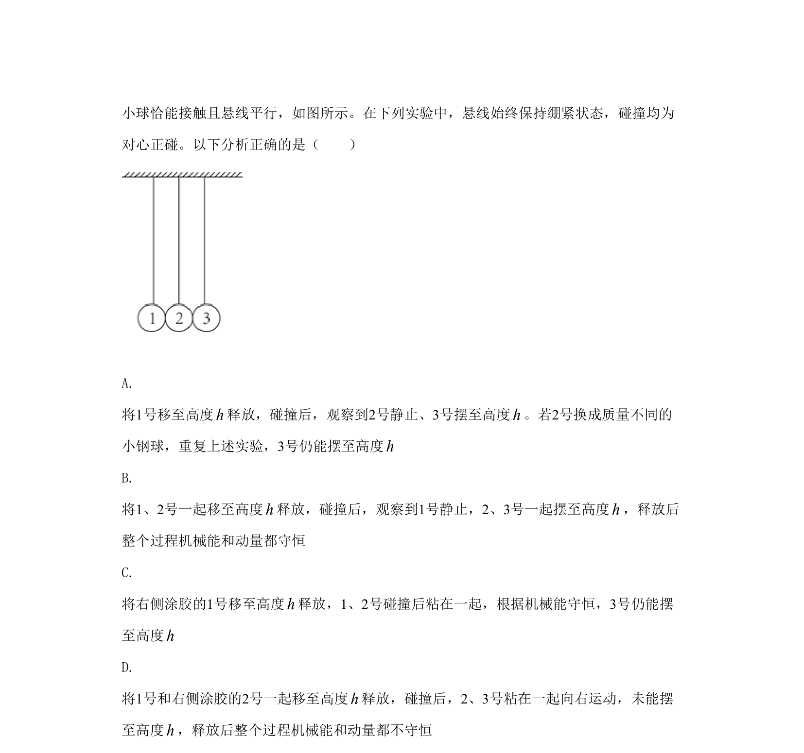
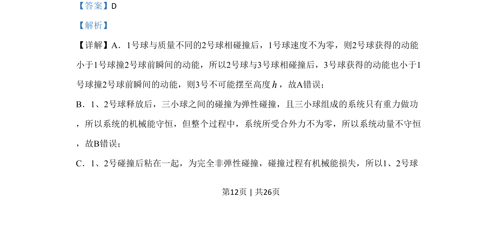
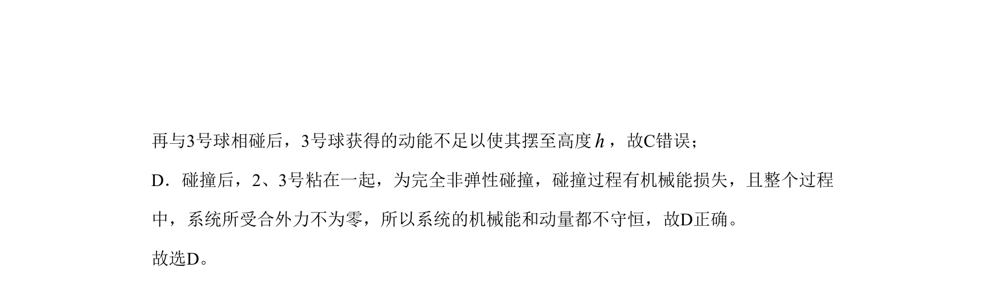

## 题面

## 摘要

碰撞过程中的能量与动量分析，弹性与非弹性碰撞的机械能、动量守恒条件辨析

## 关联考点

- [[359-弹性碰撞|弹性碰撞]]
- [[358-完全非弹性碰撞|完全非弹性碰撞]]
- [[085-机械能守恒-初中|机械能守恒]]
- [[539-动量守恒|动量守恒]]

## 答案与解析

> 📄 原 PDF 第 11 页：`素材/真题/北京/2008-2024·（北京）物理高考真题/2020年高考物理试卷（北京）（解析卷）.pdf`
