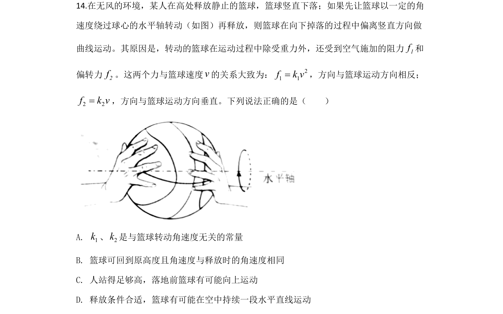
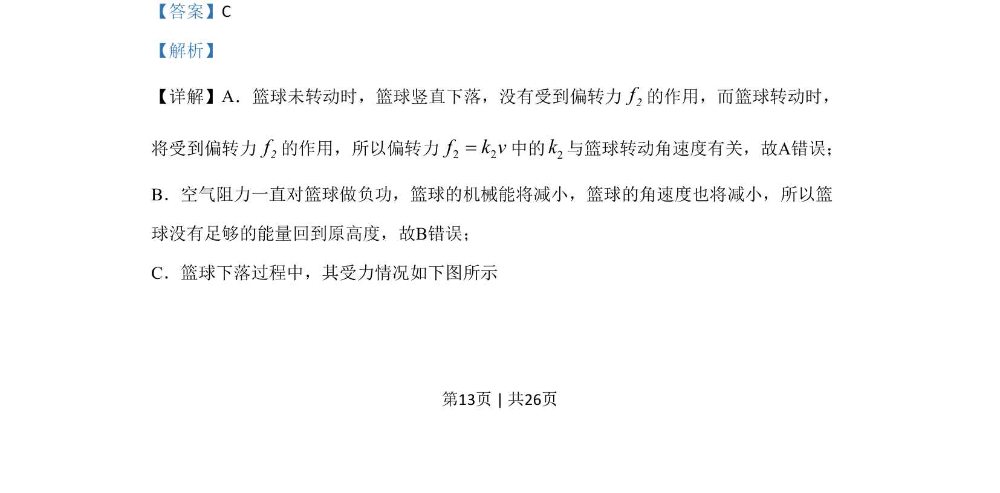
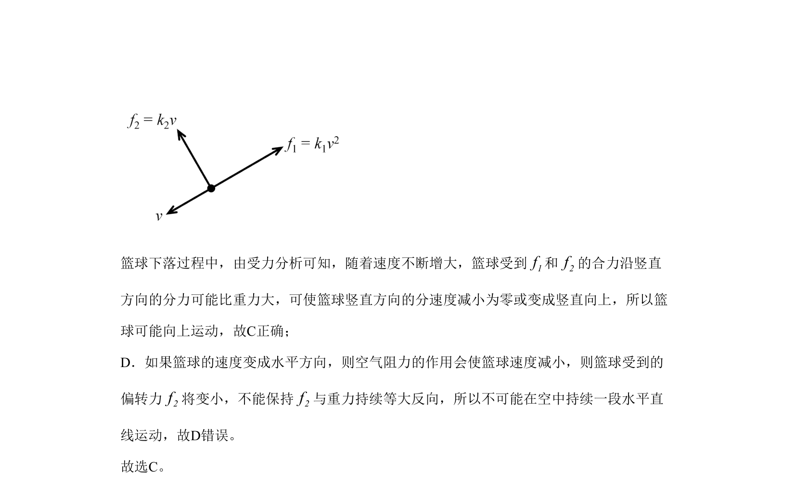

## 题面

## 摘要

篮球下落中偏转力、空气阻力和机械能变化的运动分析

## 关联考点

- [[偏转力]]
- [[850-空气阻力|空气阻力]]
- [[084-机械能|机械能]]
- [[运动分析]]

## 答案与解析

> 📄 原 PDF 第 13 页：`素材/真题/北京/2008-2024·（北京）物理高考真题/2020年高考物理试卷（北京）（解析卷）.pdf`

<!-- 题干文本-start -->
## 题干文本
14.在无风的环境，某人在高处释放静止的篮球，篮球竖直下落；如果先让篮球以一定的角
速度绕过球心的水平轴转动（如图）再释放，则篮球在向下掉落的过程中偏离竖直方向做
曲线运动。其原因是，转动的篮球在运动过程中除受重力外，还受到空气施加的阻力1f和
偏转力2f。这两个力与篮球速度v的关系大致为： 21 1f k v=，方向与篮球运动方向相反；
2 2f k v=，方向与篮球运动方向垂直。下列说法正确的是（　　）
A. 1k、2k是与篮球转动角速度无关的常量
B. 篮球可回到原高度且角速度与释放时的角速度相同
C. 人站得足够高，落地前篮球有可能向上运动
D. 释放条件合适，篮球有可能在空中持续一段水平直线运动
<!-- 题干文本-end -->

<!-- 解析文本-start -->
## 解析文本
【答案】C
【解析】
【详解】A．篮球未转动时，篮球竖直下落，没有受到偏转力2f的作用，而篮球转动时，
将受到偏转力2f的作用，所以偏转力2 2f k v=中的2k与篮球转动角速度有关，故A错误；
B．空气阻力一直对篮球做负功，篮球的机械能将减小，篮球的角速度也将减小，所以篮
球没有足够的能量回到原高度，故B错误；
C．篮球下落过程中，其受力情况如下图所示
<!-- 解析文本-end -->
