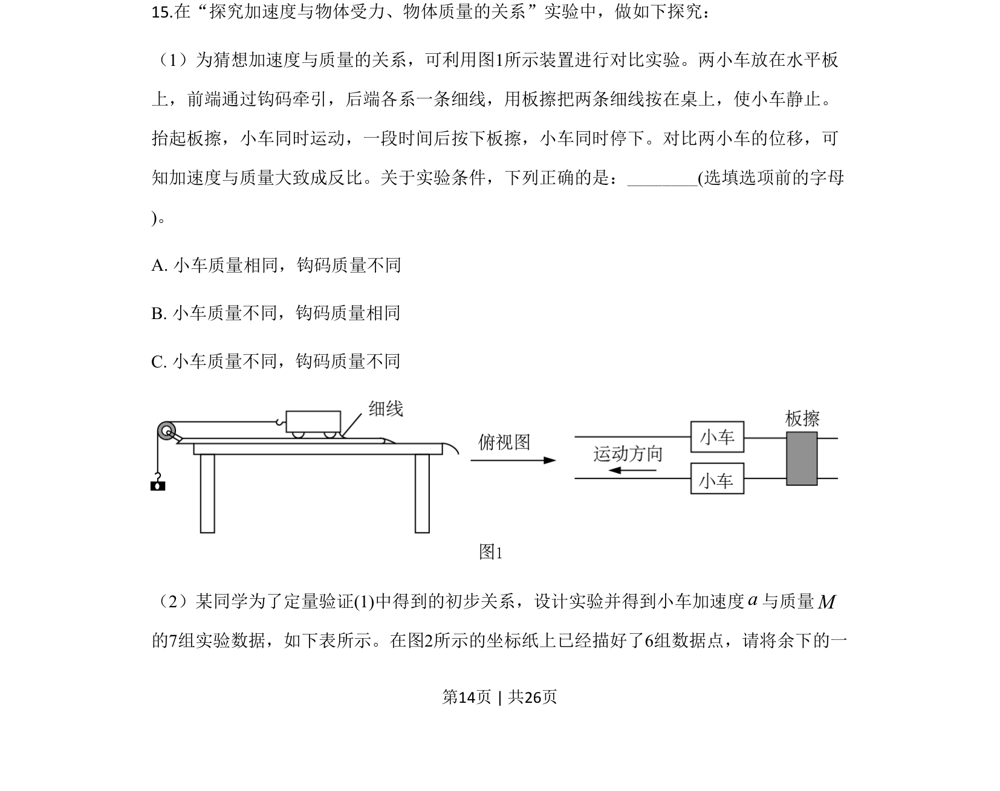
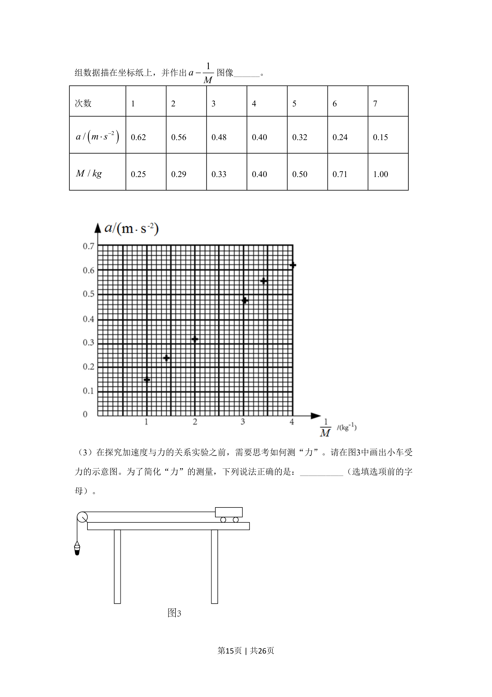
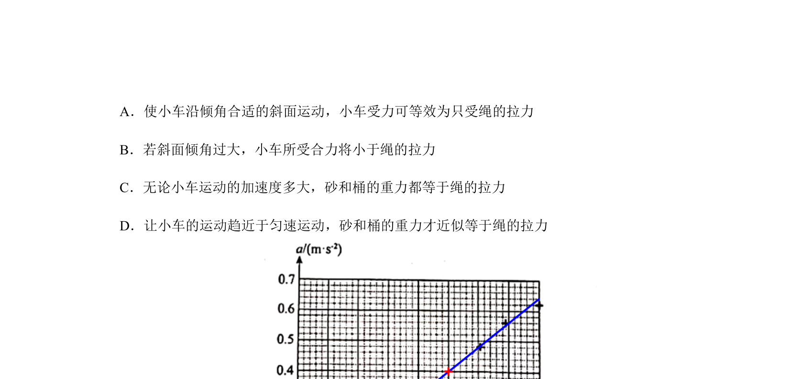
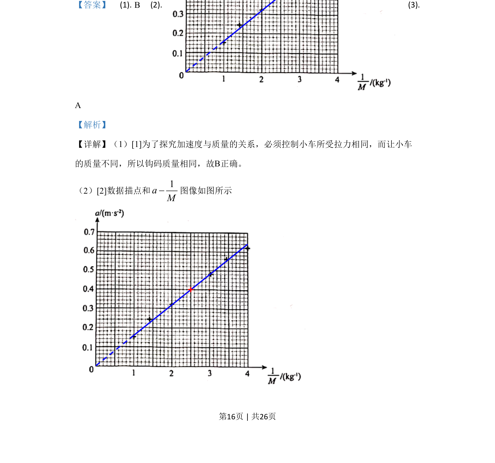
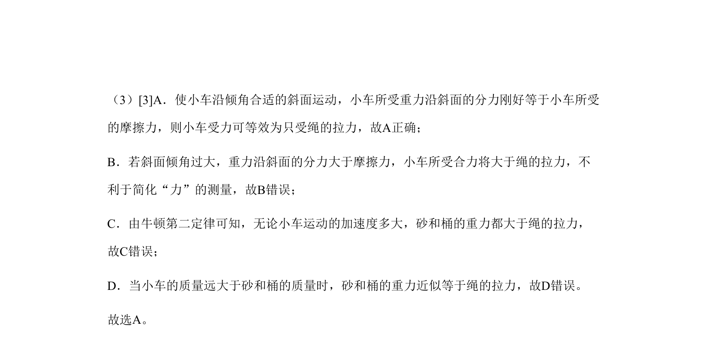

## 题面

## 摘要

该题通过探究加速度与质量关系的实验，考查实验操作、数据处理及误差分析。

## 关联考点

- [[229-牛顿第二定律|牛顿第二定律]]
- [[104-物理实验-控制变量法|控制变量法]]
- [[565-图像法|图像法]]
- [[856-平衡摩擦力|平衡摩擦力]]

## 答案与解析

> 📄 原 PDF 第 14 页：`素材/真题/北京/2008-2024·（北京）物理高考真题/2020年高考物理试卷（北京）（解析卷）.pdf`
