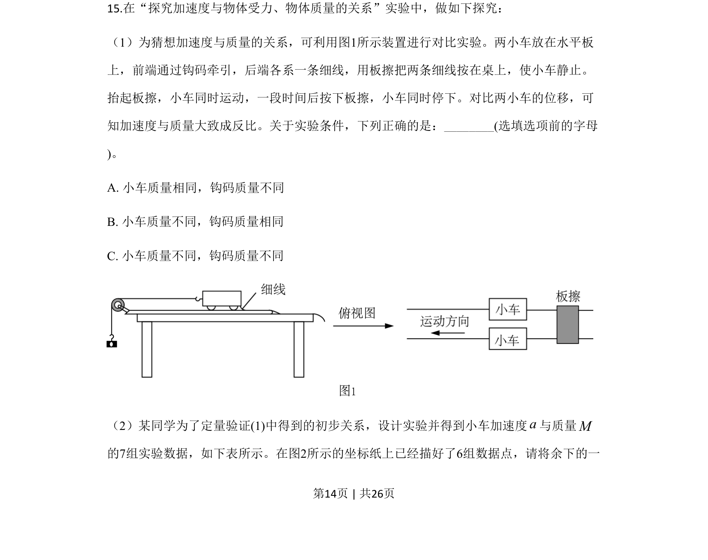
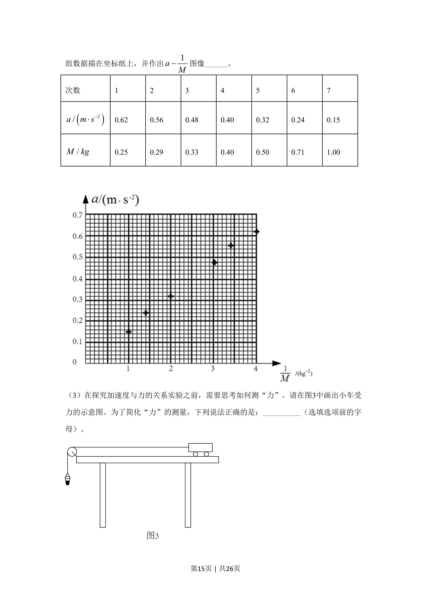
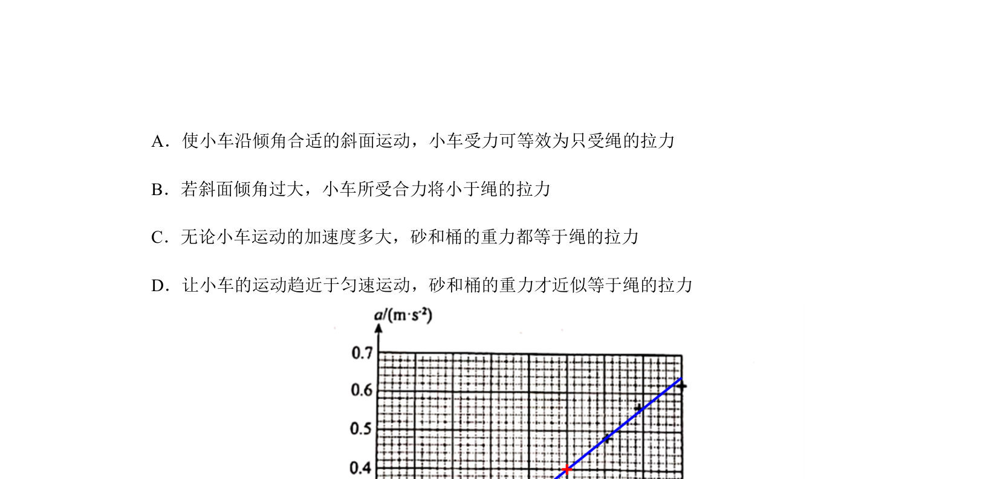
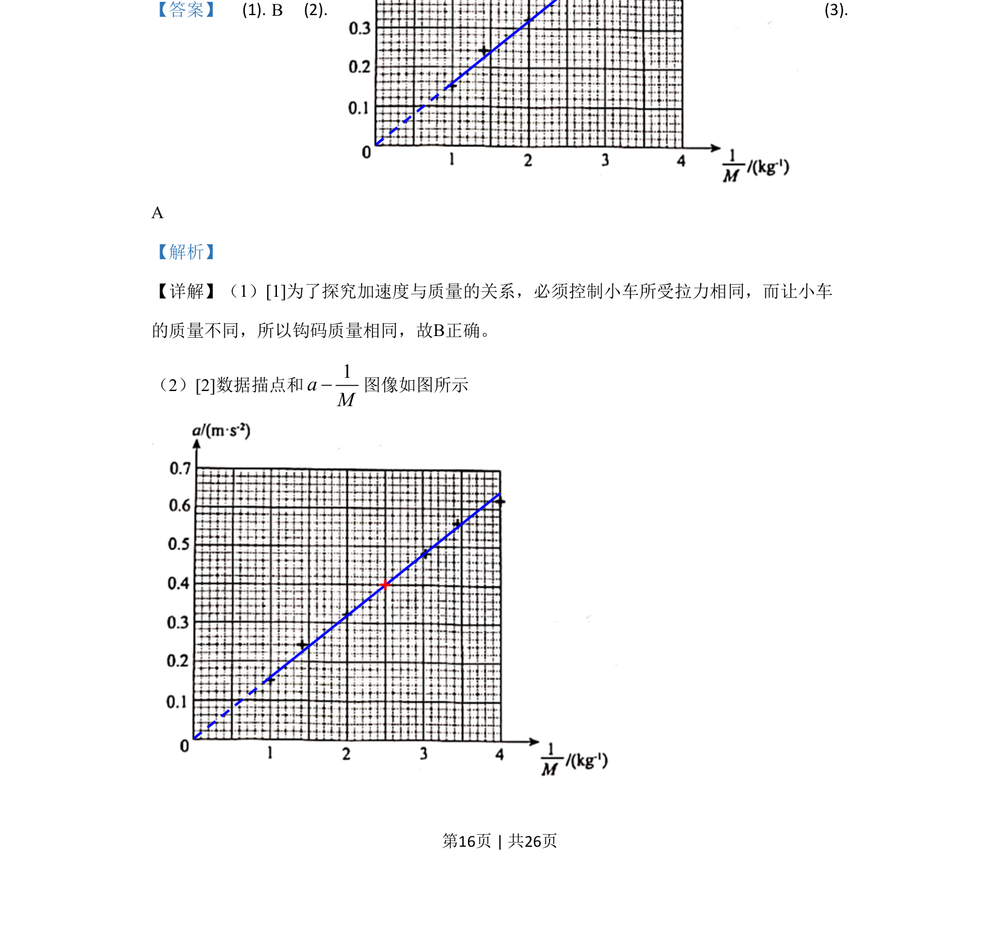
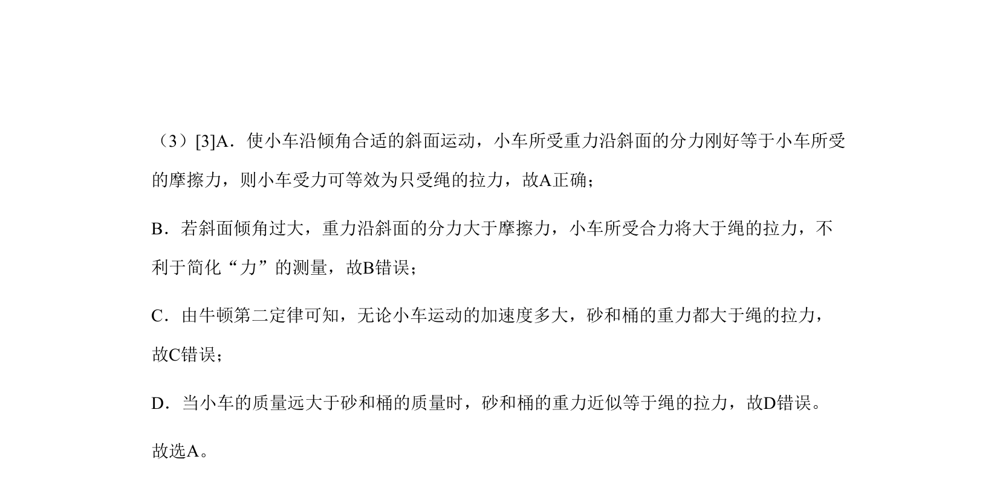

## 题面

## 摘要

该题通过探究加速度与质量关系的实验，考查实验操作、数据处理及误差分析。

## 关联考点

- [[229-牛顿第二定律|牛顿第二定律]]
- [[104-物理实验-控制变量法|控制变量法]]
- [[565-图像法|图像法]]
- [[856-平衡摩擦力|平衡摩擦力]]

## 答案与解析

> 📄 原 PDF 第 14 页：`素材/真题/北京/2008-2024·（北京）物理高考真题/2020年高考物理试卷（北京）（解析卷）.pdf`

<!-- 题干文本-start -->
## 题干文本
15.在“探究加速度与物体受力、物体质量的关系”实验中，做如下探究：
（1）为猜想加速度与质量的关系，可利用图1所示装置进行对比实验。两小车放在水平板
上，前端通过钩码牵引，后端各系一条细线，用板擦把两条细线按在桌上，使小车静止。
抬起板擦，小车同时运动，一段时间后按下板擦，小车同时停下。对比两小车的位移，可
知加速度与质量大致成反比。关于实验条件，下列正确的是：________(选填选项前的字母
)。
A. 小车质量相同，钩码质量不同
B. 小车质量不同，钩码质量相同
C. 小车质量不同，钩码质量不同
（2）某同学为了定量验证(1)中得到的初步关系，设计实验并得到小车加速度a与质量M
的7组实验数据，如下表所示。在图2所示的坐标纸上已经描好了6组数据点，请将余下的一
<!-- 题干文本-end -->

<!-- 解析文本-start -->
## 解析文本

<!-- 解析文本-end -->
