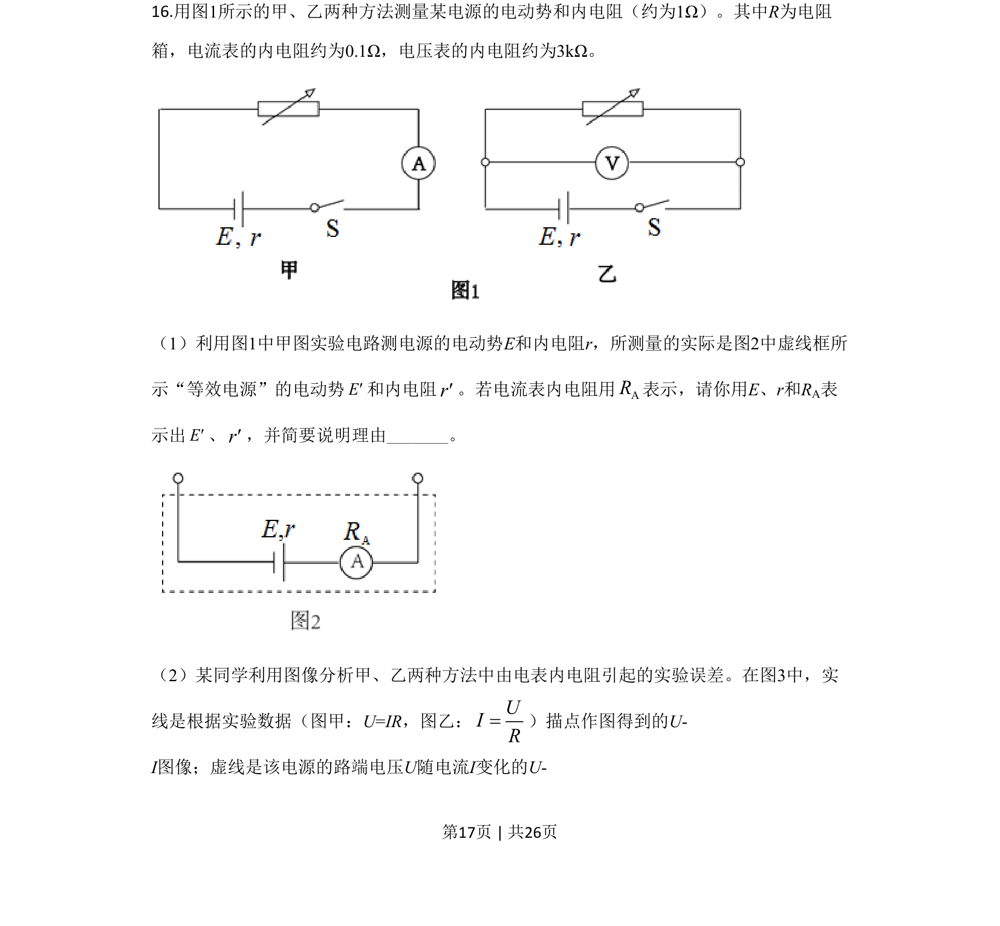
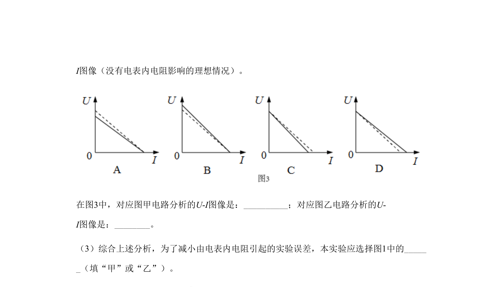
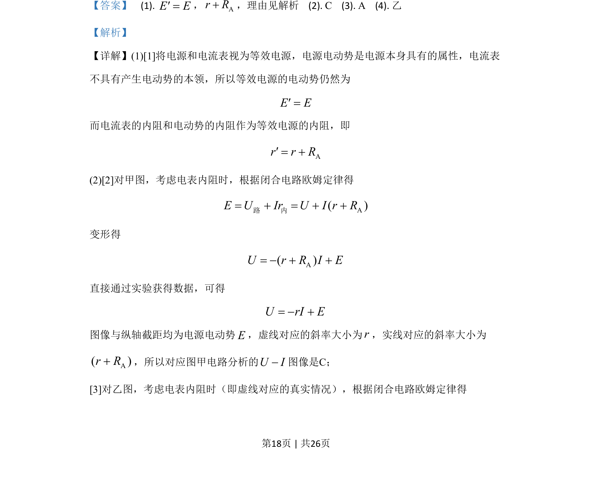
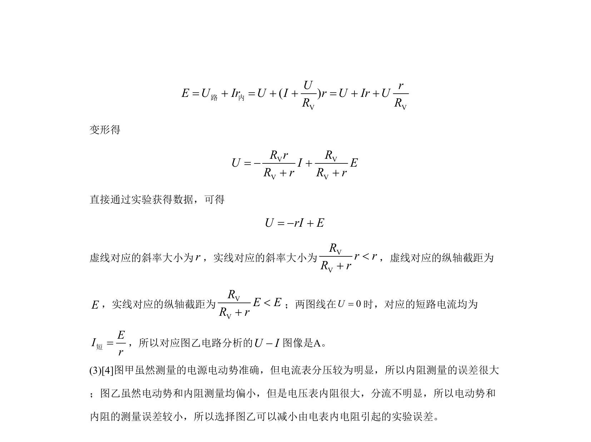

## 题面

## 摘要

测量电源电动势和内阻的实验误差分析，涉及等效电源、电表内阻及U-I图像比较。

## 关联考点

- [[332-闭合电路欧姆定律|闭合电路欧姆定律]]
- [[实验误差分析]]
- [[等效电源]]
- [[图像法处理数据]]

## 答案与解析

> 📄 原 PDF 第 17 页：`素材/真题/北京/2008-2024·（北京）物理高考真题/2020年高考物理试卷（北京）（解析卷）.pdf`
