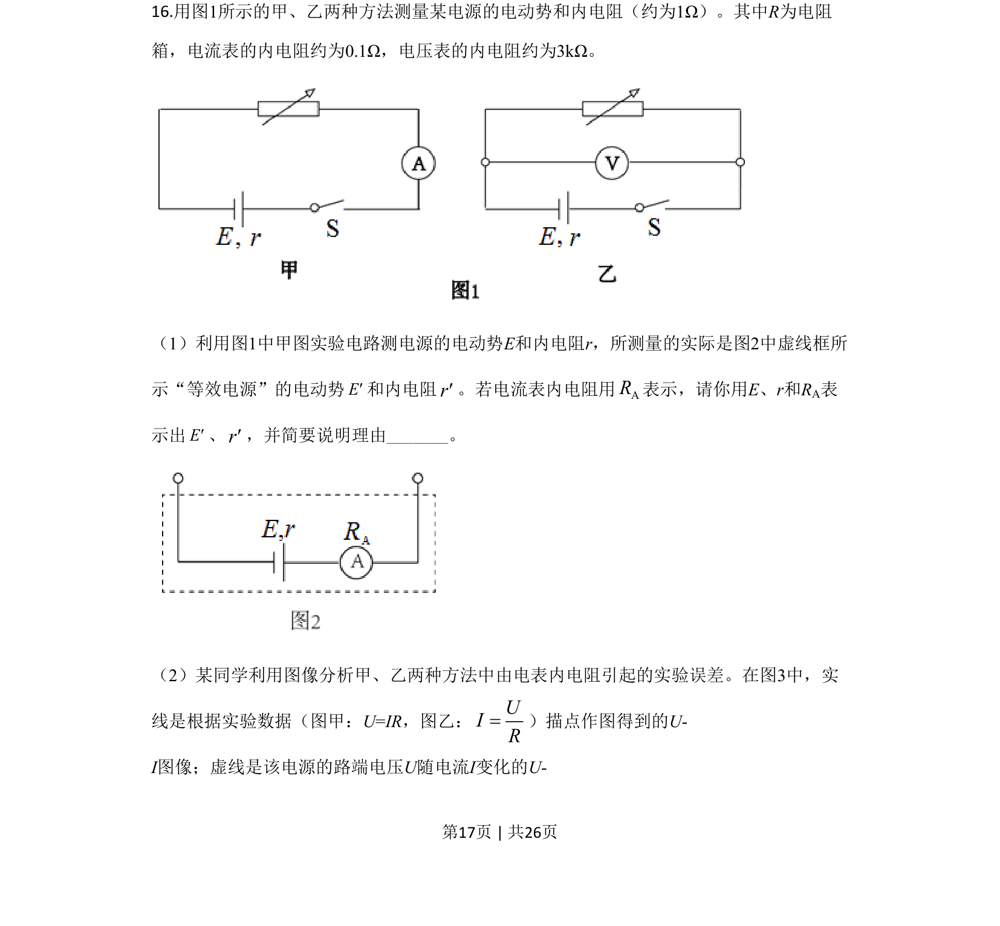
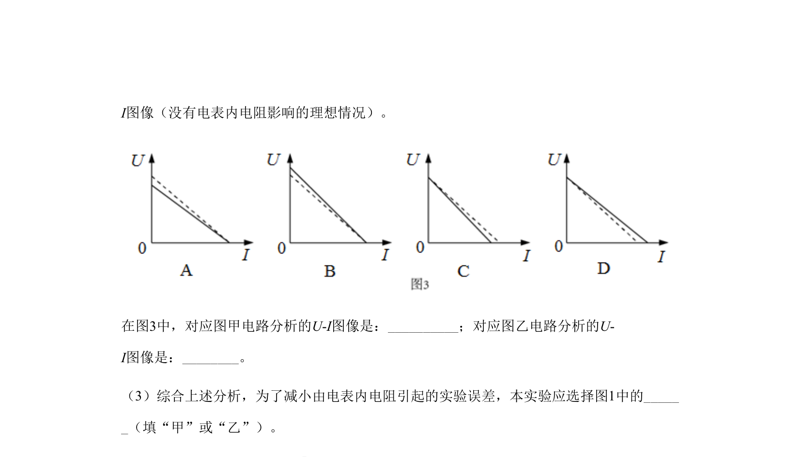
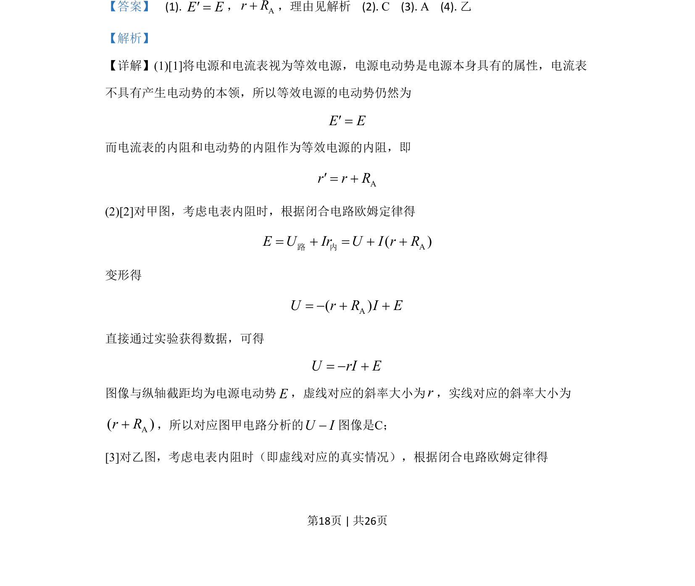
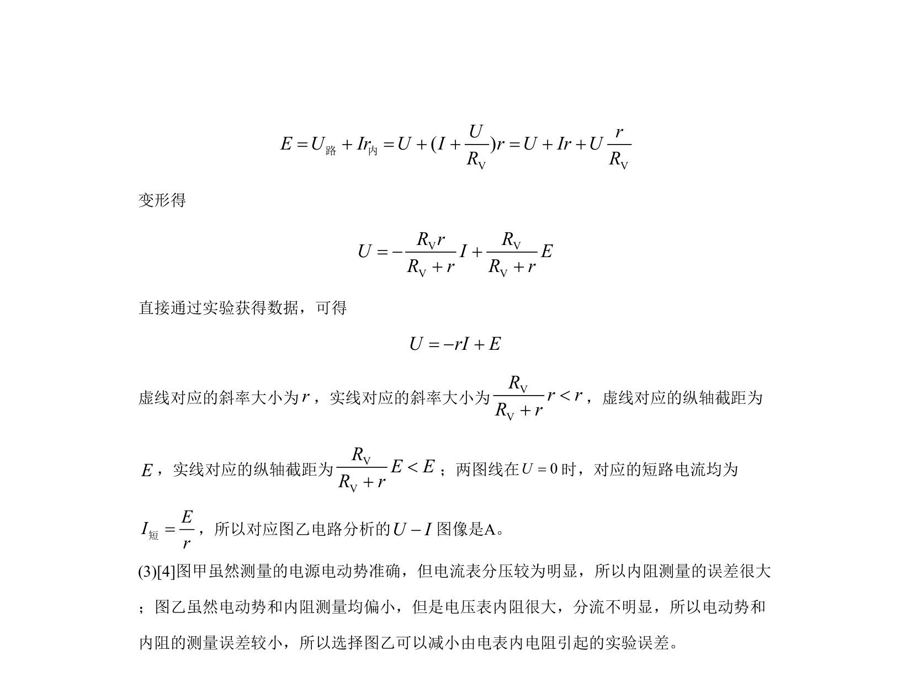

## 题面

## 摘要

测量电源电动势和内阻的实验误差分析，涉及等效电源、电表内阻及U-I图像比较。

## 关联考点

- [[332-闭合电路欧姆定律|闭合电路欧姆定律]]
- [[842-实验误差分析|实验误差分析]]
- [[等效电源]]
- [[861-图像法处理数据|图像法处理数据]]

## 答案与解析

> 📄 原 PDF 第 17 页：`素材/真题/北京/2008-2024·（北京）物理高考真题/2020年高考物理试卷（北京）（解析卷）.pdf`

<!-- 题干文本-start -->
## 题干文本
16.用图1所示的甲、乙两种方法测量某电源的电动势和内电阻（约为1Ω）。其中R为电阻
箱，电流表的内电阻约为0.1Ω，电压表的内电阻约为3kΩ。
（1）利用图1中甲图实验电路测电源的电动势E和内电阻r，所测量的实际是图2中虚线框所
示“等效电源”的电动势E¢和内电阻r¢。若电流表内电阻用AR表示，请你用E、r和RA表
示出E¢、r¢，并简要说明理由_______。
（2）某同学利用图像分析甲、乙两种方法中由电表内电阻引起的实验误差。在图3中，实
线是根据实验数据（图甲：U=IR，图乙：UIR=）描点作图得到的U-
I图像；虚线是该电源的路端电压U随电流I变化的U-
<!-- 题干文本-end -->

<!-- 解析文本-start -->
## 解析文本

<!-- 解析文本-end -->
